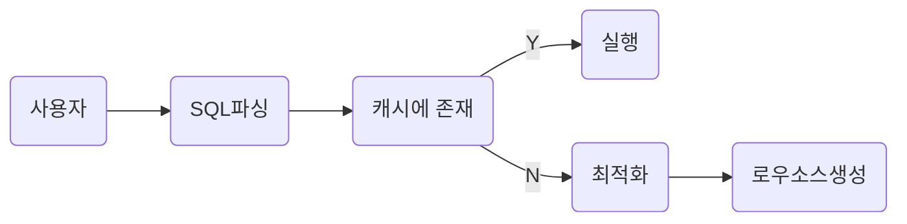
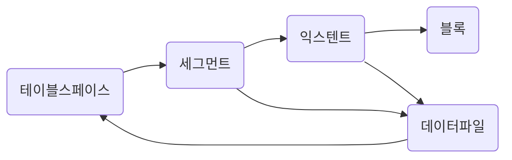
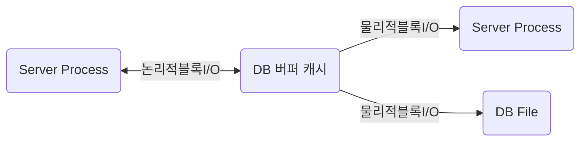

# SQLP

SQLP 준비

### SQL

→ Structured Query Language

→ 구조적 질의 언어

사용자 → (sql) → 옵티마이저 → (실행계획) → 프로시저

SQL 실행

1) SQL 파싱

- 파싱트리 생성
- SYNTAX 체크 : 문법적 오류 확인
- SEMANNTIC 체크 : 의미 상 오류 확인(존재하지 않는 테이블 OR 컬럼, 권한 존재 확인)

2) SQL 최적화

- SQL 옵티마이저는 미리 수집한 시스템 및 오브젝트 통계정보를 바탕으로 다향한 실행경로를 생성해서 비교한 후 가장 효울적인 하나를 선택한다.
- 성능을 결정하는 핵심적인 엔진

3) 로우 소스 생성 

- SQL 옵티마이저가 선택한 실행결로를 실제 실행 가능한 코드 또는 프로시저 형태로 포맷팅
- 로우 소스 생성기 가 그 역할을 맡음

※ SQL 옵티마이저

→ 사용자가 원하는 작업을 가장 효율적으로 수행할 수 있는 최적의 데이터 엑세스 경로를 선택해주는 DBMS의 핵심엔진이다.

1) 사용자로부터 전달 받은 쿼리를 수행하는 데 후보군이 될 만한 실행 계획을 찾아냄

2) 데이터 딕션너리에 미리 수집해 놓은 정보로  각 실행 계획의 예상 비용을 산정한다.

3) 최저 비용을 나타내는 실행 계획을 선택한다.

### 오라클 힌트 목록

**1. 최적화 목표**

- /*+ALL_LOWS */: 전체 처리속도 최적화
- /*+FIRST_ROWS(N) */ : 최초 N건 응답속도 최적화

**2.액세스 방식**

- /*+FULL */ :인덱스 타지말고 바로 테이블 풀스캔으로 접근해라
- /*+INDEX */: 인덱스를 타라
- /*+INDEX_DESC */: 인덱스를 ORDER BY DESC 역순으로 타라 (시간, 결과값등 최근인것 혹은 MAX값 구할때 좋음)
- /*+INDEX_FFS */: INDEX FAST FULL SCAN으로 타라
- /*+INDEX_SS */: INDEX SKIP SCAN

**3. 조인순서**

- /*+ORDERED */: FROM절에 나열된 테이블 순서대로 조인해라
- /*+LEADING */: 내가 힌트절에 열거한 테이블 순서대로 조인해라 EX: /*+ LEADING (A B C)*/

-- A,B,C 순서대로 조인하세요

- /*+SWAP_JOIN_INPUTS */: 해시조인의 경우, BUILD INPUT를 명시적으로 선택

EX: /*+ SWAP_JOIN_INPUTS(A)*/

--해시조인의경우 BUILD INPUT과 PROBE에 대한 순서를 정할 수 있다.

**4. 조인방식**

- /*+USE_NL */ :NL(NESTED LOOP - 중첩루프)방식 조인 유도
- /*+USE_MERGE */: 소트머지 조인으로 유도
- /*+USE_HASH */: 해시조인으로 유도
- /*+NL_SJ */: NL SEMI조인으로 유도
- /*+MERGE_SJ */: 소트머지 세미조인으로 유도
- /*+HASH_SJ */: 해시 세미조인으로 유도

**5. 서브쿼리팩토링**

- /*+MATERIALIZE */: WITH문으로 정의한 집합을 물리적으로 생성하도록 유도

EX) WITH /*+ MATERIALIZE*/ T AS (SELECT ...)

- /*+INLINE */: WITH문으로 정의한 집합을 물리적으로 생성하지않고 INLINE 처리하도록 유도

EX)WITH /*+ INLINE*/ T AS (SELECT ...)

**6.쿼리변환**

- /*+ MEERGE */: 뷰 머징 유도
- /*+NO_MERGE */: 뷰 머징 방지
- /*+UNNEST */: 서브쿼리 UNNESTING 유도
- /*+NO_UNNEST */: 서브쿼리 UNNESTING 방지
- /*+PUSH_PRED */: 조인조건 PUSHDOWN 유도
- /*+NO_PUSH_PRED */: 조인조건 PUSHDOWN 방지
- /*+USE_CONCAT */: OR 또는 IN-LIST조건을 OR-EXPANSION으로 유도
- /*+NO_EXPAND */: OR 또는 IN-LIST 조건에 대한 OR-EXPANSION방지

**7.병렬처리**

- /*+PARALLEL */: 테이블 스캔, DML 병렬방식으로 처리하도록 할때 사용.. 단일 대형 테이블의 접근시 정말 많이 쓴다.

EX) /*+ PARALLEL(T1 4)*/

- /*+PARALLEL_INDEX */: 인덱스 스캔을 병렬방식으로 처리하도록 유도
- /*+PQ_DISTRIBUTE */: 병렬수행시 데이터 분배방식 결정

EX) PQ_DISTRIBUTE(T1 HASH(--BUILD INPUT) HASH(--PROBE TABLE))

**8. 그외 기타**

- /*+APPEND*/: DIRECT PATH INSERT유도로 INSERT 문에 주로 많이 쓴다
- /*+DRIVING_SITE */: DB LINK REMOTE쿼리에 대한 최적화 및 실행 주체 지정 (LOCAL 또는 REMOTE)
- /*+PUSH_SUBQ */: 서브쿼리를 가급적 빨리 필터링하도록 유도
- /*+NO_PUSH_SUBQ */: 서브쿼리를 가급적 늦게 필터링 하도록 유도

### 소프트 파싱 VS 하드파싱

소프트 파싱 : 캐시에서 찾아서 곧바로 실행

하드 파싱 : 캐시에서 찾는 데 실패, 최적화 & 로우 소스 생성



※ 옵티마이저가 사용하는 정보

1) 테이블, 컬럼, 인덱스 구조에 관한 기본정보

2) 오브젝트 통계 : 테이블 통계, 인덱스 통계

3) 시스템 통계 : cpu속도, I/O 속도 등

→ 어렵게 생성한 프로시저를 한번만 사용하고 버린다면 비효율**(라이브러리 캐시가 필요한 이유)**

```sql
SELECT * FROM CUSTOMER WHERE LOGIN_ID ='oraking';
SELECT * FROM CUSTOMER WHERE LOGIN_ID ='oraking1';
SELECT * FROM CUSTOMER WHERE LOGIN_ID ='oraking2';
SELECT * FROM CUSTOMER WHERE LOGIN_ID ='oraking3';
-> 하드파싱

SELECT * FROM CUSTOMER WHERE LOGIN_ID = :?
-> 한번만 하드 파싱하고 소프트 파싱으로 처리 됨
```

### 데이터 저장 구조 및 I/O 매커니즘




- 블록 : 데이터를 읽고 쓰는 단위
- 엑스턴트 : 공간을 확장하는 단위, 연속된 블록 집합
- 세그먼트 : 데이터 자장공간이 필요한 오브젝트
- 테이블스페이스 : 세그먼트를 담는 콘테이너
- 데이터 파일 : 디스크 상의 물리적인 os 파일

※블록: DBMS가 데이터를 읽고 쓰는 단위(한 블록에 10ROW 가 있다면 1 ROW를 읽어도 한블록을 읽음)

### 시퀀셜 엑세스 VS 랜덤 엑세스

시퀀셜엑세스 : 논리적 또는 물리적으로 연결된 순서에 따라 차례대로 블록을 읽는 방식

랜덤엑세스 : 논리적 물리적 순서를 따르지 않고 한블로씩 접근

### 논리적 I/O VS 물리적 I

논리적 블록 I/O : SQL을 처리하는 과정에서 발생한 총 블럭 I/O

물리적 블록 I/O : 디스크에서 발생한 총 블록 I/O



버퍼캐시 히트율(BCHR)

: (캣기에서 찾은 블록 수 / 총 읽은 블록 수) * 100

: (논리적 I/O - 물리적 I/O ) / 논리적I/O * 100

: (1 - (물리적 I/O) / (논리적 I/O) * 100

히트율이 높아야함 !

**SQL 튜닝을 통해서 논리적 I/O 블록의 갯수를 줄이는 것이 튜닝**

| TABLE FULL SCAN | INDEX RANGE SCAN |
| --- | --- |
| MULTI BLOCKED I/O 방식 | SINGLE BLOCKED I/O 방식 |
| 수레에 데이터가 많다 | 수레에 데이터가 적다. |
|  | 반복적인 I/O |


# 인덱스 구조 및탐색

홍길동 학생을 찾는 방법

1) 모든 교실을 돌면서 찾기

2) 학생 명부를 조회해 홍길동 학생이 있는 교실만 찾아냄

### 인덱스를 통한 데이터 탐색 과정

1) 수직적 탐색 + 수평적 탐색을 통한 인덱스 탐색 진행

2) 인덱스 탐색에서 나온 rowId를 통해서 테이블 랜덤 엑세스 

### 인덱스 원리

(SELECT * FROM 고객 WHERE 고객명 = ‘이재희’)

1) 수직적 탐색 + 수평적 탐색을 통한 인덱스 탐색 진행


1) ROOT 에서 “서” 로 확인을 해봤을 때 이재희는 서 보다 뒤에 있다. 

→ 따라서 서 뒤에 있는 BRANCH 로 이동

2) BRANCH 에서 계속 스캔을 하다가 이재희보다 뒤에 있는 이재홍을 확인

→ 해당 LEAF로 내려간다.

**—> 여기까지가 수직적 탐색**

3) 이재희가 있는 곳에서 계속 조건에 만족하는 이재희를 찾는다.

**—> 여기가 수평적 탐색**

4) 인덱스 탐색을 통해서 가져온 ROW ID를 통해서 테이블에서 데이터를 가져온다.

**—> 랜덤 액세스**  

### **Index Range Scan**

- 스캔 지점에 시작점과 종료점이 있어야함
- 인덱스 컬럼이 가공되면 사용 못함(EX) 5월생의 데이터를 가져온다고 했을 때 인덱스의 시작점과 종료점을 알수 없기 때문(날짜 순으로 정렬)
- IN 조건절에 대해서는 IN-LIST Iterator 방식을 사용(IN-LIST 갯수만큰 INDEX RANGE SCAN 반복, UNION ALL 처럼)
- 인덱스의 선두컬럼이 가공되지 않으면 무조건 RANGE SCAN 이 가능한다.
- 선두 컬럼만 가공되지 않는다고 하더라도 문제가 없는 건 아님(범위가 그만큼 안 줄어들기 때문)
- 인덱스는 정렬이 되어있다. (인덱스 스캔을 할 수 있는 이유)
→ 따라서 인덱스를 사용하면 ORDER BY 를 하더라도 SORT 연산을 하지 않는다.


### **Index Full scan**

- 수직점 탐색을 하지 않고 수평적 탐색만 진행
- ename, sal 순으로 인덱스가 생성이 되었을 때 조회 조건이 sal 만 있다면 range 시작 지점과 종료지점을 정의하기가 어려워서 전체를 스캔한다.
- 즉 선두컬럼이 조회 조건에 없는 경우이다.
- 인덱스 전체 스캔
- 데이터가 적을 경우 효율적이지만 데이터가 많은 경우 그냥 테이블 full scan 이 좋다.(row id 로 테이블에 접근하는 건이 엄청 많을 거기 때문에,,)


### **Index Unique scan**

- 수직점 탐색으로만 데이터를 찾는 스캔 방식(= 조건으로 unique 인덱스)


### **Index Skip scan**

- 인덱스의 선두 컬럼이 조회 조건에 없구 데이터가 별로 없을 때는 index full scan
- 인덱스의 선두 컬럼이 조회 조건에 없구 데이터가 많은 경우 table full scan
- **인덱스의 선두 컬럼이 조건절에 없어도 인덱스를 활용하는 새로운 스캔 방식
(선두 컬럼의 Distinct Value 개수가 적고 후행 컬럼의 Distinct Value 개수가 많을 때 유용)**


```sql
select * from 사원 where 성별 = '남' and 연봉 between 2000 and 4000
```

1) 해당 쿼리를 한다면 3번 블럭을 수직적 탐색을 통해서 가져와서 rowid로 테이블을 접근한다.

```sql
select * from 사원 where 연봉 between 2000 and 4000
```

1) 해당 쿼리를 한다면 1번 블록(처음), 3번 블록 6번 블록, 7번 블록, 10번 블록(마지막)을 가져와서 rowId로 테이블에 접근한다.
**→ 특정 블록만 가져온다**

### **Index Fast Full scan**

- Multiblock I/O 방식으로 스캔해서 INDEX FULL SCAN 보다 빠름
(동시에 여러개의 브랜치에서 리프에 접근한다.)

| Index Full Scan | Index Fast Full Scan |
| --- | --- |
| 인덱스 구조를 따라 스캔 | 세그먼트 전체를 스캔 |
| 결과 집합 순서를 보장 | 결과집합 순서 보장 안됨 |
| Single Block I/O | MultiBlock I/O |
| 병렬 스캔 불가 | 병렬 스캔 가능 |
| 인덱스가 포함되지 않은 컬럼 조회 시에도 사용 가능 | 인덱스에 포함된 컬럼으로만 조회할 때 사용 가능 |

### **Index Range Scan Descending**

- 뒤에서 앞으로 스캔하는 것만 다름(내림차순)


# 인덱스 튜닝

1) 아무리 데이터가 많아도 인덱스를 사용하니까 데이터가 금방 조회된다.

2) 대량 데이터를 조회할 때 인덱스를 사용하니까 테이블 전체를 스캔할 때보다 훨씬 느리다.

**TABLE ACCESS BY INDEX ROWID**


- 인덱스를 스캔하는 이유는, 검색 조건을 만족하는 소량의 데이터를 인덱스에서 빨리 찾고 거기서 테이블 레코드를 찾아가기 위한 주소값, 즉 ROWID를 얻으려는 데 있다.

- ROWID → 물리적 주소보다 논리적 주소에 가깝다.
(물리적으로 직접 연결되지 않고 테이블 레코드를 찾아가기 위한 논리적 주소 정보를 담고 있기 때문이다.),
**→ 즉 ROWID를 통해서 테이블에 접근하는 것은 생각보다 빠르지 않다.(BCHR 이 높아서 캐시에 있더라도, 데이터 블록이 수시로 버퍼캐시에서 밀려났다가 다시 캐싱되기 때문에)**
- **인덱스 ROWID 는 우편번호(메모리 DB가 전화), 우편번호가 있더라도 시간이 꽤 걸림..**


### 인덱스 클러스터링 팩터

→ 특정 컬럼을 기준으로 같은 값을 갖는 데이터가 서로 모여있는 정도


- 굵은 선이 실제 블록 I/O가 발생하는 경우
- 클러스터링 팩터가 좋은 컬럼으로 인덱스를 작성하는 것이 블록 I/O를 감소시킬수 있다.

### 인덱스 손익분기점

- 인덱스 ROWID를 이용한 테이블 액세스는 생각보다 고비용 구조다
- **따라서 읽어야 할 데이터가 일정량을 넘는 순간, 테이블 전체를 스캔하는 것보다 오히려 느려진다.**
- TABLE FULL SCAN 은 몇건을 조회하던지 전부 동일!

**※ 인덱스를 이용한 테이블 액세스가 Table Full Scan 보다 더 느려지게 만드는 가장 핵심적인 두가지 요인**

1) Table Full Scan 은 시퀀셜 액세스인 반면, 인덱스 ROWID를 이용한 테이블 엑세스는 랜덤 액세스 방식이다.

2) Table Full Scan 은 Multiblock I/O인 반면, 인덱스 ROWID를 이용한 테이블 액세스는 Single Block I/O 방식이다.


→ 인덱스 클러스터링 팩터가 높을 수도 손익분기점이 높아진다.(데이터가 모여있어서 ROWID를 통해서 테이블에 접근하기가 쉽기 때문에)

### 인덱스 컬럼 추가

```sql
EMP_X01 인덱스[DEPTNO, JOB]

SELECT /*+INDEX(emp emp_x01) */ /*
from emp
where deptno = 30
and sal >= 2000
```

1) 인덱스 스캔을 통해서 인덱스에서 deptno = 30 인 데이터를 전부 가져오고(ex) 6개) 
2) 인덱스를 통해서 테이블 엑세스를 한다.(6개)

```sql
EMP_X01 인덱스[DEPTNO, JOB, SAL]

SELECT /*+INDEX(emp emp_x01) */ /*
from emp
where deptno = 30
and sal >= 2000
```

1) 인덱스 스캔을 통해서 인덱스에서 deptno = 30 인 데이터를 전부 가져오고(ex) 1개) 

2) 인덱스를 통해서 테이블 엑세스를 한다.(1개)

**※ 인덱스 스캔량은 줄지 않지만, 테이블 랜덤 액세스 횟수를 줄여준다.**

※ 추가적으로 조회하는 모든 컬럼이 인덱스에 존재하면 테이블 액세스를 하지 않기 떄문에 성능이 좋다.

**include 인덱스**

```sql
create index emp_x01 on emp(deptno) include(sal)

create index emp_x02 on emp(deptno, sal)
```

→ EMP_X02 인덱스는 DEPTNO, SAL 컬럼 모두 루트와 브랜치 블록에 저장(수직전 탐색 가능)

→ EMP_X01 인덱스는 SAL 컬럼을 리프 블록에만 저장해서 수평적 탐색에만 사용 가능함
    (랜덤 액세스 횟수를 줄이는 용도로 사용한다. **따라서 소트 연상을 생략할 수 없다**.)

### 인덱스 구조 테이블

- 인덱스의 ROWID를 이용한 테이블 액세스가 고비용 구조이니, 랜덤 액세스가 발생하지 않도록 테이블을 인덱스 구조로 생성하는 것


### 인덱스 클러스터 테이블

- 클러스터 키값이 같은 레코드를 한 블록에 모아서 저장하는 구조
- 랜덤엑세스를 할때 블록 단위로 진행하는데 모아 놨기 때문에 랜덤엑세스를 줄일 수 있다.


※ 해시 클러스트 테이블

→ 인덱스를 사용하지 않고 해시 알고리즘을 사용


### 부분범위 처리 활용

- fetch call 갯수 → 1억건을 조회하더라도 fetch size 100이면 느리지 않다.
- 정렬이 있다면? → 느리지만 정렬조건이 인덱스에 있다면 엄청 느리지 않다.

```sql
SELECT 게시글ID, 제목, 작성자, 등록일시
FROM 게시판
WHERE 게시판구분코드 = 'A'
ORDER BY 등록일시 DESC
```

1) 부분처리를 하려고 해도 소트연산을 생략할 수 없다.

2) 인덱스가 [게시판 구분코드 + 등록일수] → 소트연산 생략 가능하다.(인덱스가 정렬되어있기 때문에)

### 배치 I/O란?

- 인덱스 RowId를 이용한 테이블 랜덤엑세스는 고비용
- 바로 테이블에 접근하는 게 아니라 블록이 일정량 쌓이면 접근을 한다.
- 대시 sort 연산이 해결되지 않음(바로바로 접근하는게 아니여서)
- 인덱스를 믿고 정렬 생략하는 거를 지양해라(배치 i/o)

### 인덱스 스캔 효율화


```sql
WHERE C1 = 'B'
```


```sql
WHERE C1 ='B'
AND C2 = 3
```


```sql
WHERE C1 = 'B'
AND C2 >=3
```


```sql
WHERE C1 = 'B'
AND C2 <=3
```


```sql
WHERE C1 = 'B'
AND C2 BETWEEN 2 AND 3
```


```sql
WHERE C1 BETWEEN 'A' AND 'C'
AND C2 BETWEEN 2 AND 3
```


- C1 조건절은 스캔 시작과 끝 지점을 결정하는 중요한 역할을 함
- C2는 그렇지 못함, C1 =A,  C 구간에서는 어느정도 역할을 했지만 중간 C1 = ‘B’ 구간에서는 전혀 역할을 못 했다.


### 인덱스 스캔 효율성


질문1) 성능검 으로 시작하는 용어를 검색하고자 할 때 어디서 스캔을 시작하고 멈출까?

질문2) 성능으로 시작하고 네 번째 문자가 선인 용어를 검색하고자 할 때 어디서 스캔을 시작하고 멈출까?


**인덱스 선행컬림이 조건절이 없거나 = 조건이 아니면 인덱스 스캔 과정에서 비효율 발생**

### 액세스 조건과 필터 조건


 c1=성, c2=능, c4=선 
c5 =’강’(인덱스 아님) 으로 조회한다고 했을 때 

1) 인덱스 엑세스 조건

c1, c2

2) 인덱스 필터 조건

c4

3) 테이블 필터 조건

c5

### 비교 연산자 종류와 컬럼 순서에 따른 군집성


```sql
<조건절 1>
WHERE C1 = 1
AND C2 ='A'
AND C3 ='나'
AND C4 = 'a'
```

모든 레코드들이 모두 연속해서 모여 있다.(5 ~ 7번)

```sql
<조건절 2>
WHERE C1 = 1
AND C2 ='A'
AND C3 ='나'
AND C4 >= 'a'
```

모든 레코드들이 모두 연속해서 모여 있다.(5 ~ 10번)

```sql
<조건절 3>
WHERE C1 = 1
AND C2 ='A'
AND C3 between '가' and '다'
AND C4 = 'a'
```

C1, C2, C3 레코드는 모여있으나, C4 조건까지 적용하면 흩어짐(2,3,5,6,7,11번)

```sql
<조건절 4>
WHERE C1 = 1
AND C2 <='B'
AND C3 = '나'
AND C4 BETWEEN 'a' and 'b'
```

C1, C2 레코드는 모여있으나, C3, C4 조건까지 적용하면 흩어짐(5,6,7,8,9,14,15번)

**※선행컬림이 모두  = 조건인 상태에서는 첫번째 나타나는 범위검색 조건까지만 만족하는 인덱스 레코드는 모두 연속해서 모여 있지만, 그 이하 조건까지 만족하는 레코드는 비교 연산자 종류에 상관없이 흩어진다.**

```sql
<조건절 5>
WHERE C1 BETWEEN A AND 3
AND C2 <='A'
AND C3 = '나'
AND C4 ='a'
```

C1  레코드는 모여있으나 C2, C3, C4 조건까지 적용하면 흩어짐(5,6,7,18번)


### 인덱스 선행 컬럼이 등치(=) 조건이 아닐 때 생기는 비효율

```sql
SELECT *
FROM 매물아파트매매
WHERE 아파트시세코드 ='A01011350900056'
AND 평형 = '59'
AND 평형타입 = 'A'
AND 인터넷매물 BETWEEN '1' AND '3'
ORDER BY 입력일 DESC
```

1) 인덱스가 [아파트시세코드, 평형, 평형타입, 인터넷매물] 

→ 선행컬럼이 모두 = 조건이기 때문에 전혀 비효율 없이 조건을 만족하는 세 건을 빠르게 찾음


2) 인덱스가 [인터넷매물, 아파트시세코드, 평형, 평협타입]

→ 선행컬림이 = 조건이 아니기 때문에 비효율적으로 처리됨


### BETWEEN을 IN-List 로 전환

```sql
SELECT *
FROM 매물아파트매매
WHERE 아파트시세코드 ='A01011350900056'
AND 평형 = '59'
AND 평형타입 = 'A'
AND 인터넷매물 in ('1','2','3')
ORDER BY 입력일 DESC
```


⇒ 수직적 탐색을 세번 진행한거(INLIST ITERATOR 오퍼레이션)


해당 쿼리와 동일하다고 보면 된다.

```sql
SELECT *
FROM 매물아파트매매
WHERE 아파트시세코드 ='A01011350900056'
AND 평형 = '59'
AND 평형타입 = 'A'
AND 인터넷매물 = '1'
UNION ALL
SELECT *
FROM 매물아파트매매
WHERE 아파트시세코드 ='A01011350900056'
AND 평형 = '59'
AND 평형타입 = 'A'
AND 인터넷매물 = '2'
UNION ALL
SELECT *
FROM 매물아파트매매
WHERE 아파트시세코드 ='A01011350900056'
AND 평형 = '59'
AND 평형타입 = 'A'
AND 인터넷매물 = '3'
ORDER BY 입력일 DESC
```

### BETWEEN조건은 IN-List로 전환할 때 주의 사항


- IN-List 갯수가 많으면 우측처럼 수직적 탐색이 많이 발생한다.(비효율적)

### Index Skip Scan 활용

- Between 조건은 IN-List 조건으로 변환하지 않고도 같은 효과를 내는 방법

```sql
select count(*)
from 월별고객별판매집계 t
where 판매구분 = 'A'
and 판매월 between '201801' and '201812'
```

```sql
create index 월별고객별판매집계_IDX1 on 원별고객별판매집계(판매구분, 판매월);
```

→ 선행컬럼이 = 조건이여서 최적의 처리 

```sql
create index 월별고객별판매집계_IDX2 ON 월별고객별판매집계(판매월, 판매구분
```


- 인덱스 스캔 범위가 넓어져서 효율적이지 않다.

**→ 이런 경우 in으로 바꾸는 방법도 있지만 index skip scan을 활용할 수도 있다.**

```sql
select /*+ INDEX_SS(t 월별고객별판매집계_IDX2) */ COUNT(*)
from 원별고객별판매집계 t
where 판매구분 ='A'
and 판매월 between '201801' and '201812'
```

### IN 조건은 ‘=’ 인가?

```sql
SELECT *
FROM 고객별가입상품
WHERE 고객번호 = :cust_no
AND 상품ID IN('NH0037','NH0041','NH0050')

```

```sql
SELECT *
FROM 고객별가입상품
WHERE 고객번호 = :cust_no
AND 상품ID ='NH0037'
UNION ALL
SELECT *
FROM 고객별가입상품
WHERE 고객번호 = :cust_no
AND 상품ID ='NH0041'
UNION ALL
SELECT *
FROM 고객별가입상품
WHERE 고객번호 = :cust_no
AND 상품ID ='NH0050'

```

→ 첫번째 쿼리가 아래처럼 풀리면 IN 조건이 =을 여러번 사용하는 것

- IN 조건은 ‘=’이 아니다. IN 조건이 ‘=’이 되려면 IN=List Iterator 방식으로 풀려야 한다.
- 그렇지 않으면 IN 조건은 필터 조건이다.
- 무조건 IN 조건을 ‘=’ 조건으로 만들기 위해, IN-List Iterator 방식으로 푸는 것이 항상 효과적인가?
→ 범위에 따라 다르다고 보면 된다.

# NL 조

```sql
SELECT e.사원명, c.고객명, c.전화번호
from 사원 e, 고객 c
where e.입사일자 >= '19960101'
and c.관리사원번호 = e.사원번호
```


1) 사원_X1 인덱스에서 입사일자 ≥ ‘1996010’ 인 첫번째 레코드 확인

2) 인덱스에서 읽은 ROWID로 사원 테이블 레코드를 찾아간다.

3) 사원테이블에서 읽은 사원번호 ‘0006’으로 고객_X1 인덱스를 탐색

4) 고객_X1 인덱스에서 읽은 ROWID로 고객 테이블 레코드를 찾아간다.

플랜

```sql
SELECT STATEMENT Optimizer=ALL_ROWS
  NESTED LOOPS
    TABLE ACCESS (BY INDEX ROWID) OF '사원' (TABLE)
      INDEX (RANGE SCAN) OF 사원_X1(INDEX)
    TABLE ACCESS (BY INDEX ROWID) OF '고객' (TABLE)
      INDEX (RANGE SCAN) OF 고객_X1(INDEX)
```

```sql
select /*+ ordered use_nl(c) index(e) index(c) */
       e.사원번호, e.사원명, e.입사일자
      ,c.고객번호, c.고객명, c.전화번호, c.최종주문금액
from  사원 e, 고객 c
where c.관리사원번호 = e.사원번호
and   e.입사일자 >= '19960101'
and   e.부서코드  = 'Z123'
and   c.최종주문금액 >= 2000

-- 인덱스 구성
사원_px : 사원번호
사원_x1 : 입사일자
고객_px : 고객번호
고객_x1 : 관리사원번호
고객_x2 : 최종주문 금액
```

1) 사원_x1 인덱스 스캔(입사일자) + 부서코드로도 스캔(테이블스캔)

2) 1) 돌면서 조인 조건에 있는 사원번호를 통해서 고객 스캔(고객_x1) + 최종주문금액(테이블스캔)


**NL 조인 튜닝 포인트**

1) 랜덤 엑세스 위주의 조인방식

2) 한 레코드 씩 순차적으로 진행

3) 소량의 데이터를 처리하거나 부분범위 처리

→ 조인 순서를 통해서 튜닝 가능
EX) 사원 입사일자 조건이 너무 많은 경우 사원이 앞에 있으면 JOIN 횟수가 많아짐
      반대로 고객의 최종 주문 금액이 20000 이상인 사원이 너무 많으면 고객을 앞으로 옮기면 비효율

**NL 조인 확장 매커니즘**

- 오라클은 NL 조인 성능을 높이기 위해 테이블 prefetch, 배치 I/O기능 도입
- 테이블 PREFETCH : 인덱스를 통해서 테이블을 액세스하다가 디스크 I/O 필요해지면 미리 읽음
- 배치I/O : 디스크 I/O CALL 을 미뤗다가 읽을 블록이 일정량 쌓이 한꺼번에 처리


# 소트 머지 조인

1) 조인 컬럼에 인덱스 없을때

2) 대량 데이터 조인이여서 인덱스가 효과적이지 않을때

```sql
select /*+ ordered use_merge(c) */
       e.사원번호, e.사원명, e.입사일자
      ,c.고객번호, c.고객명, c.전화번호, c.최종주문금액
from 사원 e, 고객 c
where c.관리사원번호 = e.사원번호
and   e.입사일자 >='19960101'
and   e.부서코드 ='Z123'
and   c.최종주문금액 >= 20000
```

1) 소트 단계 : 양쪽 집합을 조인 컬럼 기준으로 정렬한다.

2) 머지 단계 : 정렬한 양쪽 집합을 서로 머지한다.

**PGA에_정렬된_사원**

```sql
select 사원번호, 사원명, 입사일자
from 사원
where 입사일자 >= '19960101'
and 부서코드 ='Z123'
order by 사원번호
```

**PGA에_정렬된_고객**

```sql
select 고객번호, 고객명, 전화번호, 최종주문일시, 관리사원번호
from 고객 
where 최종주문금액 >= 20000
order by 관리사원번
```

→ 각각의 결과 집합을 pga 영역에 할당된 sort Area 에 저장(정렬한 결과집합이 PGA에 담을 수 없을 정도로 크면 Temp 테이블 스페이스에 저장)

두가지 정렬된 데이터를 스캔하면서 처리한다.

```sql
begin
  for outer in(select * from PGA에_정렬된사원)
  loop    -- outer 루프
    for inner in(select * from PGA에_정렬된_고객
                  where 관리사원번호 = outer.사원번호)
    loop -- inner 루프
       dbms_output.put_line( ...);
    end loop;
  end loop;
end
```


- PGA에_정렬된_고객테이터가 정렬되어있어서 풀스캔 안됨
- 정렬되어있기 때문에 멈출 수 있음

### 소트 머지 조인이 빠른 이유

1) NL 조인은 인덱스를 사용한 조인 방법 이지만 대량 데이터에서는 건건이 디스크에서 읽어 드린다.(대량 데이터에서 불리)

2) 소트 머지 조인은 양쪽 테이블로부터 조인 대상 집합에 저장한 후 조인한다.(PGS는 프로세스만을 위한 독립적인 메모리 공간이므로 데이터를 읽을 때 래치 획득 과정이 없다.)
→ 이것이 대량 데이터 조인에 유리한 이유

3) 정렬을 하는 부분이 있지만 그 부분 때문에 오히려 조인에 유리

4) 그룹을 만드는 쿼리에서도 물론 인덱스 사용 가능

### 소트 머지 조인의 주용도

1) 조인 조건식이 등치(=) 조건이 아닌 대량 데이터 조인

2) 조인 조건식이 아예 없는 조인

**3) 인덱스가 조인 컬럼에 없어도사용하면 좋을 것 같다.**

# 해시 조인

### 기본매커니즘

1) Build 단계 : 작은 쪽 테이블(Build Input)을 읽어 해시 테이블(해시 맵)을 생성한다.

2) Probe 단계 : 큰 쪽 테이블(Probe Input)을 읽어 해시 테이블을 탐색하면서 조인한다.

```sql
select /*+ ordered use_hash(c) */
       e.사원번호, e.사원명, e.입사일자
      ,c.고객번호, c.고객명, c.전화번호, c.최종주문금액
from 사원 e, 고객 c
where c.관리사원번호 = e.사원번호
and   e.입사일자 >= '19960101'
and   e.부서코드 = 'Z123'
and   c.최종주문금액 >= 20000
```


```sql
select 사원번호, 사원명, 입사일자
from 사원
where 입사일자 >= '19960101'
and   부서코드 = 'Z123'
```

1) Build 단계: 위에 조건에 해당하는 사원 데이터를 읽어 해시 테이블을 생성한다.
(조인 컬럼인 사원번호를 해시 테이블 키 값으로 사용한다.)

```sql
select 고객번호, 고객명, 전화번호, 최종주문금액, 관리사원번호
from 고객
where 최종주문금액 >= 20000
```

2) Probe 단계: 위에 조건에 해당하는 고객 데이터를 하나씩 읽어 앞서 생성한 해시테이블을 탐색한다.

```sql
begin 
 for outer in (select 고객번호, 고객명, 전화번호, 최총주문금액, 관리사원번호 
               from 고객 
               where 최총주문금액 >= 20000) 
 loop -- outer 루프
      for inner in (select 사원번호, 사원명, 입사일자 
                    from PGA 생성한-사원- 해시맵               
                    where 사원번호 = outer 관리사원번호) 
      loop -- inner 루프 
        dbms_output . put_line ( · · · ) ; 
      end loop; 
 end loop; 
end;  
```


### 해시 조인이 빠른 이유

1) Hash Area에 생선한 해시테이블을 이용한다는 점만 다를 조인 nl과 프로세싱이 같다.

2) 해시 테이블을 PGA 영역에 할당하기 때문에 빠르다.(소트 머지 조인이 빠른 이유와 동일)

3) 소트머지보다 빠른 이유는 PGA 집합을 만들때 정렬을 안하기 때문

### 해시 조인 실행계획 제어

```sql
select /*+ use_hash(e c) */
       e.사원번호, e.사원명, e.입사일자
      ,c.고객번호, c.고객명, c.전화번호, c.최종주문금액
from 사원 e, 고객 c
where c.관리사원번호 = e.사원번호
and   e.입사일자 >= '19960101'
and   e.부서코드 = 'Z123'
and   c.최종주문금액 >= 20000
```

```sql
SELECT STATEMENT Optimizer=ALL_ROWS
  HASH JOIN
   TABLE ACCESS (BY INDEX ROWID) OF '사원' (TABLE)
     INDEX (RANNGE SCAN) OF '사원_X1' (INDEX)
   TABLE ACCESS (BY INDEX ROWID) OF '고객' (TABLE)
     INDEX (RANNGE SCAN) OF '고객_N1' (INDEX)   
```

- ues_hash 힌트만 사용했으므로 Build Input을 옵티마이저가 선택하는데, 일반적으로 둘 중 카디널리티가 작은 테이블을 선택한다.(사원이 Build Input)

```sql
select /*+ leading(e) use_hash(c) */
       e.사원번호, e.사원명, e.입사일자
      ,c.고객번호, c.고객명, c.전화번호, c.최종주문금액
from 사원 e, 고객 c
where c.관리사원번호 = e.사원번호
and   e.입사일자 >= '19960101'
and   e.부서코드 = 'Z123'
and   c.최종주문금액 >= 20000
```

- e를 먼저 앞으로 정의 가능(leading)

```sql
select /*+ use_hash(e c) swap_join_inputs(e) */
       e.사원번호, e.사원명, e.입사일자
      ,c.고객번호, c.고객명, c.전화번호, c.최종주문금액
from 사원 e, 고객 c
where c.관리사원번호 = e.사원번호
and   e.입사일자 >= '19960101'
and   e.부서코드 = 'Z123'
and   c.최종주문금액 >= 20000
```

- swap_join_inputs 힌트로 Build Input을 직접 선택하는 방법도 있다.

### 세 개 이상 테이블 해시 조인


```sql
select *
from A, B, C
where A.key = B.key
and   B.key = C.key
```

```sql
select *
from A, B, C
where A.key = B.key
and   A.key = C.key
```


### 조인 메소드 선택 기준


1) 소량 데이터 조인할 때 →NL 조인

2) 대량 데이터 조인할 때 → 해시 조인

3) 대량 데이터 조인인데 히시 조인으로 처리할 수 없는 때, 즉 조인 건식이 등치(=) 조건이 아닐때(조인 조건식이 아예 없는 카테시안 곱 포함 → 소트 머지 좆인

- NL 조인과 해시 조인과 성능이 같으면, NL 조인
- 해시 조인과 약간 더 빨라도 NL 조인
- NL 조인보다 해시 조인이 매우 빠른 경우, 해시 조인

**해시 조인 쓰는 경우**

1) 수행 빈도가 낮고

2) 쿼리 수행 시간이 오래 걸리는

3) 대량 데이터 조인할 때


# 서브쿼리 조인


1) 인라인 뷰(Inline View) : FROM 절에 사용한 서브쿼리를 말한다.

2) 중첩된 서브쿼리(Nested Subquery) : 결과집합을 한정하기 위해 WHERE 절에 사용한 서브쿼리를 말한다. 특히, 서브쿼리가 메인 쿼리 컬럼을 찾조하는 형태를 ‘상관관계 있는 서브쿼리’ 라고 부른다.

3) 스칼라 서브쿼리 : 한 레코드당 정확히 하나의 값을 반환하는 서브쿼리다. 주로 SELECT-LIST 에서 사용하지만 몇 가지 예외사항을 제외하면 컬럼이 올 수 있는 대부분 위치에 사용할 수 있다.

### 중첩된 서브쿼리

```sql
<원본쿼리
select c.고객번호, c.고객명
from   고객 c
where  c.가입일시 >= trunc(add_months(sysdate - 1), 'mm')
and    exists(
            select 'x'
            from   거래
            where  고객번호 = c.고객번호
            and    거래일시 >= trunc(sysdate, 'mm'))

<쿼리 블록 1>
select c.고객번호, c고객명
from 고객 c
where c.가입일시 >= trunc(add_months(sysdate, -1),'mm')

<쿼리블록2>
select 'x'
from 거래
where 고객번호 = :cust_no -- 메인쿼리를 참조하는 조건절은 변수로 처리
and   거래일시 >= trunc(sysdate, 'mm');

```

```sql
< 원본 쿼리 >
select 고객번호, 고객명, t. 평균거래, t. 최소거래, 최대거래 
from 고객 c 
     ,(select 고객번호, avg{ 거래금액) 평균거래 
            , min( 거래금액) 최소거래, max( 거래금액) 최대거래 
       from 거래 
       where 거래일시 >= trunc(sysdate, 'mm') 
       group by 고객번호 ) t 
where 가입일시 >= trunc(add_months(sysdate, -1), 'mm') 
and 고객번호 = 고객번호 

< 쿼리 블록 1 >
select 고객번호, 고객명, 평균거래, t. 최소거래, 최대거래 
from 고객 c, SYS VW TEMP t
where c. 가입일시 >= trunc(add_months(sysdate, -1 )， 'mm') 
and 고객번호 = 고객번호 

< 쿼리 불룩 2 >
select 고객번호, avg( 거래금액) 평균거래 
      , min( 거래금액) 최소거래, max( 거래금액) 최대거래 
from 거래 
where 거 래 일 시 >= trunc( sysdate, 'mm') 
group by 고객 번호
```

- 서브쿼리별로 블록을 만들어서 실행함
- 블록에 대한 최적화도 확인 필요

### 필터 오퍼레이션

**/*+ no_unnest */**

→ 서브쿼리를 풀어내지 말고 그대로 수행하라고 옵티마이저에 지시하는 힌트

```sql
select c.고객번호, c.고객명
from 고객 c
where c.가입일시 >= trunc(add_months(sydate -1),'mm')
and exists(
    select /*+no_unnest */ 'x'
    from 거래
    where 고객번호 = c.고객번호
    and   거래일시 >= trunc(sysdate, 'mm'))

-- PLAN
SELECT STATEMENT Optimizer=ALL_ROWS
  FILTER
   TABLE ACCESS (BY INDEX ROWID) OF '고객' (TABLE)
     INDEX (RANGE SCAN) OF '고객_X01' (INDEX)
   INDEX(RANGE SCAN) OF '거래_X01' (INDEX)
```

- 필터 오퍼레이션은 기본적으로 NL 조인과 처리 루틴이 값다.
- FILTER 를 NESTED LOOPS 로 치환하고 처리 루틴을 해석하면 된다.

차이점
1) 필터는 메인쿼리(고객)의 한 로우가 서브쿼리(거래)의 한 로우와 조인에 성공하는 순간 진행을 멈추고, 메인쿼리의 다음 로우를 계속 처리함

```sql
begin
  for outer in(select 고객번호, 고객명 from 고객 where...)
  loop 
    for inner in(select 'x' from 거래 where 고객번호 = outer.고객번호 and...)
    loop
      dbms_output.put_line(outer.고객번호 || ',' || outer.고객명);
      exit; -- 조인에 성공하면 inner loop exit
    end loop;
   end loop;
end;
```

2) 필터는 캐싱 기능을 갖는다.

3) 필터 서브쿼리는 일반 NL 조인과 달리 메인쿼리에 종속되므로 조인 순서가 고정된다.

**서브쿼리 Unnesting**

```sql
select c.고객번호, c.고객명
from 고객 c
where c.가입일시 >= trunc(add_months(sydate -1),'mm')
and exists(
    select /*+unnest nl_sj */ 'x'
    from 거래
    where 고객번호 = c.고객번호
    and   거래일시 >= trunc(sysdate, 'mm'));

-- PLAN
SELECT STATEMENT Optimizer=ALL_ROWS
  NESTED LOOP(SEMI)
   TABLE ACCESS (BY INDEX ROWID) OF '고객' (TABLE)
     INDEX (RANGE SCAN) OF '고객_X01' (INDEX)
   INDEX(RANGE SCAN) OF '거래_X01' (INDEX)
```

- Unnesting 하고 나면 일반 조인문처럼 다양한 최적화 기법을 사용할 수 있다.
- unnest 와 nl_sj 힌트를 함께 사용했으므로 NL 세미조인 방식으로 실행
- 오라클 10g 부터는 NL 세미조인도 캐싱 기능

**서브쿼리 Unnesing + leading**

```sql
select /*+ leading(거래@subq) use_nl(c) */ c.고객번호, c.고객명
from 고객 c
where c.가입일시 >= trunc(add_months(sydate -1),'mm')
and exists(
    select /*+ qb_name(subq) unnest*/ 'x'
    from 거래
    where 고객번호 = c.고객번호
    and   거래일시 >= trunc(sysdate, 'mm'));

-- PLAN
SELECT STATEMENT Optimizer=ALL_ROWS
  NESTED LOOP
    NESTED LOOP
      SORT (UNIQUE)
       TABLE ACCESS (BY INDEX ROWID) OF '거래' (TABLE)
         INDEX (RANGE SCAN) OF '거래_X02' (INDEX)
      INDEX(RANGE SCAN) OF '고객_X01' (INDEX)
    TABLE ACCESS (BY INDEX ROWID) OF '고객' (TABLE)
```

- 거래를 먼저 스캔하고 그 이후에 고객을 스캔한다.
- 고객에 대한 데이터가 많고 거래에 대한 데이터가 적을 때 효율적
- SORT(UNIQUE) = 서브쿼리에서 중복 데이터 제거
- 아래의 쿼리와 비슷

```sql
select /*+ no_merge(t) leading(t) use_nl(c) */ c.고객번호, c.고객명
from (select distinct 고객번호
      from 거래
      where 거래일시 >= trunc(sysdate, 'mm')) t, 고객 c
where c.가입일시 >= trunc(add_months(sysdate, -1), 'mm')
and   c.고객번호 = t.고객번호
```

**서브쿼리 Unnesting + hash_sj**

```sql
select c.고객번호, c.고객명
from 고객 c
where c.가입일시 >= trunc(add_months(sydate -1),'mm')
and exists(
    select /*+ unnest hash_sj*/ 'x'
    from 거래
    where 고객번호 = c.고객번호
    and   거래일시 >= trunc(sysdate, 'mm'));

-- PLAN
SELECT STATEMENT Optimizer=ALL_ROWS
 FILTER
   HASH JOIN (SEMI)
     TABLE ACCESS (BY INDEX ROWID) OF '고객'(TABLE)
       INDEX (RANGE SCAN) OF '고객_X01'(INDEX)
     TABLE ACCESS (BY INDEX ROWID) OF '거래'(TABLE)
       INDEX (RANGE SCAN) OF '거래_X02' (INDEX)
```

※ Unnesting 과 rownum

```sql
select 글번호, 제목, 작성자, 등록일시
from 게시판 b
where 게시판구분 ='공지'
and   등록일시 >= trunc(sysdate -1)
and   exists (select /*+ unnest nl_sj */ 'x'
              from 수신대상자
              where 글번호 = b.글번호
              and   수신자 =:memb_no
              and   rownum <=1)
```

- rownum 조건이 있어서 unnest 가 안되고 no_unnest 로 처리되서 세미조인 등의 조인이 적용이 안된다

**서브쿼리 Pushing**

```sql
select /*+ leading(p) use_nl(t) */ count(distinct p.상품번호), sum(t.주문금액)
from 상품 p, 주문 t
where p.상품번호 = t.상품번호
and   p.등록일시 >= trunc(add_months(sysdate, -3), 'mm')
and   t.주문일시 >= trunc(sysdate - 7)
and   exists (select 'x' from 상품분류
              where 상품분류코드 = p.상품분류코드
              and   상위분류코드 = 'AK')

STATEMENT
 SORT AGGREGATE
  FILTER 
   NESTED LOOPS
    TABLE ACCESS FULL 상품
    TABLE ACCESS BY INDEX ROWID 주문
     INDEX UNIQUE SCAN 주문_PK
   TABLE ACCESS BY INDEX ROWID 상품분류
    INDEX UNIQUE SCAN 상품분류_PK
```

- 상품 풀스캔 이후 주문 PK 인덱스로 인해서 주문 스캔해서 NL 조인
- NL 조인된 거를 FILTER 조인을 통해서 상품분류 테이블과 진행

IF) 상품이 1000개가 나오고 조인에 성공한 주문 데이터가 60000개라면 **상품 + 주문 조인** 쿼리의 수행시간이 너무 길다.( 그 이후의 상품 분류에서 60000개에서 3000개로 변경)
: 이런 경우에는 상품 분류를 앞쪽으로 옮기면 상품 → 주문으로 가는 조인의 갯수를 줄일 수 있다.

```sql
select /*+ leading(p) use_nl(t) */ count(distinct p.상품번호), sum(t.주문금액)
from 상품 p, 주문 t
where p.상품번호 = t.상품번호
and   p.등록일시 >= trunc(add_months(sysdate, -3), 'mm')
and   t.주문일시 >= trunc(sysdate - 7)
and   exists (select /*+ NO_UNNEST PUSH_SUBQ */'x' from 상품분류
              where 상품분류코드 = p.상품분류코드
              and   상위분류코드 = 'AK')

STATEMENT
 SORT AGGREGATE
   NESTED LOOPS
    TABLE ACCESS FULL 상품
     TABLE ACCESS BY INDEX ROWID 상품분류
      INDEX UNIQUE SCAN 상품분류_PK
    TABLE ACCESS BY INDEX ROWID 주문
     INDEX UNIQUE SCAN 주문_PK
```

- 상품과 상품분류를 NL조인해서 수를 줄이고(150) 그걸 주문과 같이 처리 해서 전체적인 효율 증가

### 뷰(VIEW)와 조인

```sql
select c.고객번호, c.고객명, t.평균거래, t.최소거래, t.최대거래
from 고객 c
    ,(select 고객번호, avg(거래금액) 평균거래
             ,min(거래금액) 최소거래, max(거래금액) 최대거래
      from 거래
      where 거래일자 > trunc(sysdate, 'mm')
      group by 고객번호) t
where c.가입일시 >= trunc(add_months(sysdate, -1),'mm')
and   t.고객번호 = c.고객번호

-- execution plan

SELECT STATEMENT 
 NESTED LOOPS
  NESTED LOOPS
    VIEW
      HASH (GROUP BY)
        TABLE ACCESS (BY INDEX ROWID) OF 거래 (TABLE)
          INDEX (RANGE SCAN) OF '거래_X01' (INDEX)
    INDEX (RANGE SCAN) OF '고객_X01' (INDEX)
  TABLE ACCESS (BY INDEX ROWID) OF '고객'
```

- 서브쿼리를 뷰로 만들고 고객 C와 NL조인을 한다.
- 고객 테이블에서 ‘전월 이후 가입한 고객’을 필터링하는 조건이 인라인 뷰 바깥에 있다
(인라인 뷰 안에서는 당월에 거래한 ‘**모든’** 고객의 거래 데이터를 읽어야 한다.

**1) 뷰 머징**

```sql
select c.고객번호, c.고객명, t.평균거래, t.최소거래, t.최대거래
from 고객 c
    ,(select /*+ merge */ 고객번호, avg(거래금액) 평균거래
             ,min(거래금액) 최소거래, max(거래금액) 최대거래
      from 거래
      where 거래일자 > trunc(sysdate, 'mm')
      group by 고객번호) t
where c.가입일시 >= trunc(add_months(sysdate, -1),'mm')
and   t.고객번호 = c.고객번호

-- execution plan

SELECT STATEMENT 
 HASH (GROUP BY)
  NESTED LOOPS
   TABLE ACCESS (BY INDEX ROWID) OF '고객'
     INDEX (RANGE SCAN) OF '고객_X01'
   TABLE ACCESS (BY INDEX ROWID) OF '거래'
     INDEX (RANGE SCAN) OF '거래_X02'
```

- MERGE가 되면서 그냥 테이블 끼리 JOIN 된 것을 알 수 있다.
- 아래의 쿼리와 동일하다고 보면 된다.

```sql
select c.고객번호, c.고객명
      ,avg(t.거래금액) 평균거래, min(t.거래금액) 최소거래, max(t.거래금액) 최대거래
from  고객 c, 거래 t
where c . 가 입 일 시 >= trunc ( add_months ( sysdate , - 1 ) , 'mm' ) 
and 고객번호 = 고객번호 
and 거래일시 >= trunc(sysdate, 'mm' ) 
group by 고객번호, 고객명
```

2**) 조인 조건 Pushdown**

→ 11g 이후에 적용된 기능, 메인쿼리를 실행하면서 조인 조건절 값을 건건이 뷰 안으로 밀어넣는 기능

```sql
select c.고객번호, c.고객명, t.평균거래, t.최소거래, t.최대거래
from 고객 c
    ,(select /*+ merge push_pred */ 고객번호, avg(거래금액) 평균거래
             ,min(거래금액) 최소거래, max(거래금액) 최대거래
      from 거래
      where 거래일자 > trunc(sysdate, 'mm')
      group by 고객번호) t
where c.가입일시 >= trunc(add_months(sysdate, -1),'mm')
and   t.고객번호 = c.고객번호

-- 플랜

SELECT STATEMENT 
 NESTED LOOPS
   TABLE ACCESS (BY INDEX ROWID BATCHED)
     INDEX (RANGE SCAN) OF '고객_X01' (INDEX)
   VIEW PUSHED PREDICATE
     SORT (GROUP BY)
      TABLE ACCESS (BY INDEX ROWID BATCHED) OF '거래' (TABLE)
        INDEX (RANGE SCAN) OF '거래_X02'
        

select c.고객번호, c.고객명, t.평균거래, t.최소거래, t.최대거래
from 고객 c
    ,(select /*+ merge push_pred */ 고객번호, avg(거래금액) 평균거래
             ,min(거래금액) 최소거래, max(거래금액) 최대거래
      from 거래
      where 거래일자 > trunc(sysdate, 'mm')
      and   고객번호 = c.고객번호
      group by 고객번호) t
where c.가입일시 >= trunc(add_months(sysdate, -1),'mm')
and   t.고객번호 = c.고객번호

```

- 위와 같이 인라인 뷰에 조인 컬럼 조건을 넣는다고 보면 된다.
- 즉 거래를 가져올때 거래일자로만 가져오는게 아니라 고객번호도 조건에 포함이다.

### 스칼라 서브쿼리 조인

**스칼라 서브쿼리의 특징**

```sql
select empno, ename, sal, hiberdate, GET_DNAME(e.deptno) as dname
from emp e
where sal >= 2000
```

- SELECT 쿼리를 메인 쿼리 건수 만큼 ‘재귀적으로’ 반복 실행한다.(GET_DNAME 에 있는 쿼리)

```sql
select empno, ename, sal, hibernate
      ,(select d.dname from depth d where d.deptno = e.deptno) as dname
from emp e
where sal >= 2000

-- 아래와 비슷한 효과
select /* ordered use_nl(d) */ e.empno, e.name, e.sal, e.hibernate, d.dname
from emp e, depth d
where d.deptno(+) = e.deptno
and   e.sal >= 2000
```

- 컨텍스트 스위칭 없이 메인쿼리와 서브쿼리를 한 몸체처럼 실행한다.
- 스칼라 서브쿼리는 처리과정에서 **캐싱 작용** 이 일어난다.

```sql
select empno, ename, sal, hiberdate
, (select GET_DNAME(e.deptno) from dual) as dname
from emp e
where sal >= 2000
```

- 함수에 캐싱 효과를 적용할 수 있다.

**스칼라 서브쿼리 캐싱 부작용**

1) 서브쿼리에서 나오는 사용하는 값(입력값)이 거의 무조건 다르면 캐싱을 써봤자 의미가 없다.
(메모리만 먹을 뿐)

**두개 이상의 값 반환**

```sql
select c.고객번호, c.고객명
      ,(select round(avg(거래금액), 2) 평균거래금액
        from 거래
        where 거래일시 >= trunc(sysdate, 'mm')
        and   고객번호 = c.고객번호)
from    고객 c
where   c.가입일시 >= trunc(add_months(sysdate, -1), 'mm')

-- Execution plan
SELECT STATEMENT 
  SORT (AGGREGATE)
    TABLE ACCESS (BY INDEX ROWID BATCHED) OF '거래' (TABLE)
      INDEX (RANGE SCAN) OF '거래_X2' (INDEX)
  TABLE ACCESS (FULL) OF '고객' (TABLE)
    INDEX (RANGE SCAN) OF '고객_X01' (INDEX)
```

- NL과 비슷하지만 메인 쿼리가 아래에 있다는 점 존재

```sql
select c.고객번호, c.고객명
      ,(select avg(거래금액), min(거래금액), max(거래금액)
        from 거래
        where 거래일시 >= trunc(sysdate, 'mm')
        and   고객번호 = c.고객번호)
from    고객 c
where   c.가입일시 >= trunc(add_months(sysdate, -1), 'mm')

```

- 스칼라 서브 쿼리의 캐시 기능을 쓸수가 없다.

```sql
select c.고객번호, c.고객명
      ,(select avg(거래금액)
        from 거래
        where 거래일시 >= trunc(sysdate, 'mm')
        and   고객번호 = c.고객번호)
      ,(select min(거래금액)
        from 거래
        where 거래일시 >= trunc(sysdate, 'mm')
        and   고객번호 = c.고객번호)
      ,(select max(거래금액)
        from 거래
        where 거래일시 >= trunc(sysdate, 'mm')
        and   고객번호 = c.고객번호)
from    고객 c
where   c.가입일시 >= trunc(add_months(sysdate, -1), 'mm')
```

- 캐시는 사용가능하지만 거래 테이블에서 같은 데이터를 반복해서 읽는 비효율 존재

```sql
select 고객번호, 고객명 
    , to_number(substr( 거래금액, 1, 10)) 평균거래금액 
    , to_number(substr( 거래금액, 11, 10)) 최소거래금액 
    , to_number(substr( 거래금액, 21 )) 최대거래금액 
from ( 
  select 고객번호, C. 고객명 
     ,(select lpad(avg( 거래금액), 10) I l lpad(min( 거래금액), 10) I l max( 거래금액) 
        from 거래 
        where 거래일시 >= trunc ( sysdate , 'mm' ) 
        and 고객번호 = 고객번호) 거래금액 
from 고객 c 
where 가입일시 >= trunc(add_months(sysdate, -1), 'mm')
)
```

- SQL 튜너들이 전통적으로 많이 사용해 온 방식

```sql
select 고객번호, 고객명, 평균거래, 최소거래, 최대거래 
from 고객 ( 
    ,(select 고객번호, avg( 거래금액) 평균거래 
           , min( 거래금액) 최소거래, max( 거래금액 ) 최대거래 
      from 거래 
      where 거 래 일 시 >= trunc ( sysdate , ' mm ' ) 
      group by 고객번호) t 
where c.가입일시 >= trunc(add_months(sysdate, ， 'mm') 
and   t.고객번호(+) = 고객번호
```

- 그냥 인라인 뷰를 쓰면 편리하긴하다

※ 두 개 이상의 값을 반화하고 싶을 때,   인라인 뷰 VS 스칼라 서브 쿼리

인라인 뷰 :
1) 뷰가 머징 되지 않았을 때 당월 거래 전체를 읽어야 하거나 

2) 머징이 된다고 하더라도 GROUP BY 때문에 부분 처리가 안되는 문제 가 있다.

—> 하지만 PUSH_PRED 방식이 생기면서 인라인 뷰 + no_merge push_pred를 쓰면 좋다.

```sql
select 고객번호, 고객명, 평균거래, 최소거래, 최대거래 
from 고객 ( 
    ,(select /*+ no_merge push_pred */ 
            고객번호, avg( 거래금액) 평균거래 
           , min( 거래금액) 최소거래, max( 거래금액 ) 최대거래 
      from 거래 
      where 거 래 일 시 >= trunc ( sysdate , ' mm ' ) 
      group by 고객번호) t 
where c.가입일시 >= trunc(add_months(sysdate, ， 'mm') 
and   t.고객번호(+) = 고객번호

-- execution plan
SELECT STATEMENT
 NESTED LOOPS
   TABLE ACCESS (BY INDEX ROWID BATCHED) OF '고객' (TABLE)
     INDEX (RANGE SCAN) OF '고객_X01' (INDEX)
   VIEW PUSHED PREDICATE
     SORT (GROUP BY) 
       TABLE ACCESS (BY INDEX ROWID BATCHED) OF '거래' (TABLE)
         INDEX (RANGE SCAN) OF '거래_X02'(INDEX)
```

**스칼라 서브쿼리 Unnesting**

- 스칼라 서브쿼리도 NL 방식(SORT) 으로 조인하므로 캐싱 효과가 크지 않으면 랜던 I/O 부담이 있다.
- 그래서 다른 조인 방식을 선택하기 위해 스칼라 서브쿼리를 일반 조인문으로 변환하고 싶을 때가 있다.

```sql
select c.고객번호, c.고객명
      ,(select /*+ unnest */ round(avg( 거래금액), 2) 평균거래금액 
        from 거래 
        where 거 래 일 시 >= trunc ( sysdate, ' mm ' ) 
        and 고객번호 = 고객번호)
from    고객 c
where   c.가입일시 >= trunc(add_months(sysdate, -1), 'mm')

SELECT STATEMENT
  HASH JOIN
    TABLE ACCESS (FULL) OF '고객' (TABLE)
    VIEW OF 'SYS.VW_SSQ_1' (VIEW)
      HASH (GROUP BY)
        TABLE ACCESS (FULL) OF '거래' (TABLE)
```

→ 스칼라 서브 쿼리이지만 HASH 사용


# 소트 튜닝
## 소트 수행 과정

메모리 소트 : 전체 데이터의 정렬 작업을 메모리 내에서 완료하는 것을 말하며, Internal Sort 라고도 한다.

디스크 소트 : 할당받은 Sort Area 내에서 정렬을 완료하지 못해 디스크 공간까지 사용하는 경우를 말하며, External Sort 라고도 한다.


- 소트가 최대한 발생 안하도록 처리해야 한다.
- 발생하더라도 PGA 안에서 처리되게 하는게 좋다.
- 그렇지 않다면 Temp Tablespace 를 사용하게 되고 그러면 Sort Area 문제도 있기 때문

**(1) Sort Aggregate**
→ Sort Aggregate는 아래처럼 전체 로우를 대상으로 집계를 수행할 때 나타난다. ‘Sort’ 라는 표현을 사용하지만, 실제로 데이터를 정렬하진 않는다. **Sort Area를 사용한다는 의미로 이해하면 된다.**

```sql
select sum(sal), max(sal), min(sal), avg(sal) from emp;

-- 실행계획
SELECT STATEMENT
 SORT AGGREGATE
  TABLE ACCESS FULL
```

- Sort Area SUM, MAX, MIN, AVG 값 구하는 절차
1) Sort Area에 SUM, MAX, MIN, COUNT 값을 위한 변수를 각각 하나씩 할당한다.
2) EMP 테이블 첫 번째 레코드에서 읽은 SAL 값을 SUM, MAX, MIN 변수에 저장하고, COUNT 변수에는 1을 저장한다.


**(2) Sort Order by** 

→ 데이터를 정렬할 때 나타난다.

```sql
select * from emp order by sal desc;

-- 실행계획
SELECT STATEMENT
 SORT ORDER BY
  TABLE ACCESS FULL
```

**(3) Sort Group by**

→ 소팅 알고리즘을 사용해 그룹별 집계를 수행할 때 나타난다.

```sql
select deptno, sum(sal), max(sal), min(sal), avg(sal)
from emp
group by deptno
order by deptno

-- 실행계획
SELECT STATEMENT
 SORT GROUP BY
  TABLE ACCESS FULL
```


- 수천 명의 사원이 근무하는 회사, 부서가 4개, 부서코드로는 각각 10,20,30,40을 사용
- 집계 하려고 할때 메모지 4개에다가 적는 다는 개념으로 가면
- Sort Area 가 클 필요가 전혀 없다.

```sql
select deptno, sum(sal), max(sal), min(sal), avg(sal)
from emp
group by deptno

-- 실행계획
SELECT STATEMENT
 HASH GROUP BY 
  TABLE ACCESS FULL
```

- 오라클 10gR2 버전 부터는 order by 가 없으면 hash 로 처리


**(4) Sort Unique**

```sql
select /*+ ordered use_nl(dept) */ * from dept
where deptno in(select /*+ unnest */ deptno
                from emp where job = 'CLERT');

-- 실행계획
SELECT STATEMENT
 NESTED LOOPS
  SORT UNIQUE
   TABLE ACCESS BY INDEX ROWID(EMP)
    INDEX RANGE SCAN(EMP_JOB_IDX)
  TABLE ACCESS BY INDEX ROWID(DEPT)
   INDEX UNIQUE SCAN(DEPT_PK)
```

- 메인쿼리와 조인하기 전에 중복 레코드부터 제거해야한다.
- 조인 컬럼에 UNIQUE 인덱스가 없으면 SORT UNIQUE 실행

※ UNION, MINUS, INTERSECT 같은 집합(Set) 연산자를 사용할 때도 아래와 같이 Sort Unique 오퍼레이션이 나타난다.(DISTINCT 도 동일)**(UNION ALL 은 그냥 다 하는 거여서 Sort Unique 연산 x)**

**(5) Sort Join**

→ Sort Join 오퍼레이션은 소트 머지 조인을 수행할 때 나타난다.

```sql
select /*+ ordered use_merge(e) */ *
from dept d, emp e
where d.deptno = e.deptno

-- 실행 계획
SELECT STATEMENT
 MERGE JOIN
  SORT JOIN
   TABLE ACCESS FULL DEPT
  SORT JOIN
   TABLE ACCESS FULL EMP
```

**(6) Window Sort**

```sql
select empno, ename, job, mgr, sal
      ,avg(sal) over (partition by deptno)
from emp;

-- 실행 계획
SELECT STATEMENT
 WINDOW SORT
  TABLE ACCESS FULL EMP
```

## 소트가 발생하지 않도록 SQL 작성

### Union vs Union All

```sql
select 결제번호, 주문번호, 결제금액, 주문일자
from   결제
where 결제수단코드 = 'M' and 결제일자 = '20180316'
union
select 결제번호, 주문번호, 결제금액, 주문일자
from   결제
where 결제수단코드 = 'C' and 결제일자 = '20180316'
```

- 중복 가능성이 없지만 UNION 을 사용함으로 인해 소트 연산을 발생시키고 있다
- 위아래가 상호 배타적이니까 UNION ALL을 사용하는게 좋다.(소트 연산 생략 가능)

```sql
select 결제번호, 주문번호, 결제금액, 주문일자
from   결제
where 결제일자 = '20180316'
union
select 결제번호, 주문번호, 결제금액, 주문일자
from   결제
where 주문일자 = '20180316'
```

- 상호배타적인 조건이 아니기 때문에 UNION 을 써야됨(소트 연산)

```sql
select 결제번호, 주문번호, 결제금액, 주문일자
from   결제
where 결제일자 = '20180316'
union all
select 결제번호, 주문번호, 결제금액, 주문일자
from   결제
where 주문일자 = '20180316'
and   결제일자 <> '20180316'
```

→ 아래 내용 처럼 처리해서 소트 연산을 생략할 수 있다.

### Exists 활용

```sql
select DISTINCT p.상품번호, p.상품명, p.상품가격, ...
from 상품 p, 계약 c
where p.상품유형코드 = :pclscd
and   c.상품번호 = p.상품번호
and   c.계약일자 between :dt1 and :dt2
and   c.계약구분코드 :ctpcd
```

- 상품과 계약을 use_nl 조인을 하고 hash(unique)를 통해서 필터한다.(상품수가 적고 계약 수가 많을 수록 비효율적)

```sql
select p.상품번호, p.상품명, p.상품가격,...
from   상품 p
where  p.상품유형코드 = :pclscd
and    EXISTS (select 'x' from 계약 c
               where c.상품번호 = p.상품번호
               and   c.계약일자 between : dt1 and : dt2 
               and   c.계약구분코드 = : ctpcd )
```

- Exists 서브쿼리는 데이터 존재 여부만 확인하면 되기 때문에 조건절을 만족하는 데이터를 모두 읽지 않는다.
- 즉 상품에서 for 문을 돌면서 계약으로 넘어갈때 계약에 존재만 하면 바로 넘어가서 계약을 보는 범위가 적다

## 인덱스를 이용한 소트 연산 생략

### Sort Order By 생략

```sql
select 거래일시, 체결건수, 체결수량, 거래대금
from   종목거래
where  종목코드 ='KR123456'
order by 거래일시
```

**case1) 인덱스가 [종목코드 + 거래일시] 아닌경우**

```sql
SELECT STATEMENT
 SORT ORDER BY
  TABLE ACCESS BY INDEX ROWID 종목
   INDEX RANGE SCAN           종목거래_N1
```

- 만족하는 레코드를 전체 읽은 다음에 SORT을 해야한다.

**case2) 인덱스가 [종목코드 + 거래일시] 인 경우**

```sql
SELECT STATEMENT
  TABLE ACCESS BY INDEX ROWID 종목
   INDEX RANGE SCAN           종목거래_N1
```

- 종목코드를 통해서 데이터에 접근하면 그냥 순서대로 가져오면 정렬된거다(인덱스인 종목코드. 거래일시 순으로 정렬이 되어있는 거니까)

### Top N 쿼리

```sql
select * from (
  select 거래일시, 체결건수, 체결건수, 체결수량, 거래대금
  from 종목거래
  where 종목코드 = 'KR123456'
  and   거래일시 >= '20180304'
  order by 거래일시
)
where rownum <=10
```

- 부분처리가 불가능해 보이지만 만약 인덱스를 [종목코드 + 거래일시] 순으로 구성하면
아래 그림처럼 인덱스를 순서대로 10개만 읽으면 되기 때문에 부분 처리에 효율적이다.


```sql
SELECT STATEMENT 
 COUNT (STOPKEY)
   VIEW
    TABLE ACCESS (BY INDEX ROWID) OF 종목거래 (TABLE)
      INDEX (RANGE SCAN) OF '종목거래_PK' (INDEX (UNIQUE))
```

- Sort Order By 오퍼레이션이 보이지 않는다. 대신 COUNT(STOPKEY) 가 보인다.
→ 이는 조건절에 부합하는 레코드가 아무리 많아도 그 부분처리 가
- **Top N Stopkey 알고리즘**

**페이징 처리**

```sql
select * 
from (
 select rownum no, a.*
 from
  (
   
   /* SQL Body */
   ) a
where rownum <= (:page * 10)
)
where no >= (:page -1 )*10 +1
```

- Top N 쿼리이므로 ROWNUM 으로 지정한 건수만큼 결과 레코드를 얻으면 거기서 바로 멈춘다.
- 뒤쪽 페이지로 이동할수록 읽는 데이터량도 많아지는 단점이 있지만, 보통 앞쪽 일부 데이터만 확인하므로 문제가 되지 않는다.

```sql
select * 
from (
  select rownum no, a.*
  from
   (
     select 거래일시, 체결건수, 체결수량, 거래대금
     from  종목거래
     where 종목코드 ='KR123456'
     and   거래일시 >='20180304'
     order by 거래일시
   ) a
)
where no between (:page - 1)*10 + 1 and(:page *10)

-- 실행계획
SELECT STATEMENT 
 FILTER
  VIEW 
    COUNT
      VIEW
       TABLE ACCESS (BY INDEX ROWID) OF '종목거래'
         INDEX(RANGE SCAN) OF 종목거래_PK
```

- 해당 쿼리가 간단해 보이지만 Top N 쿼리 방식을 사용할 수 없기 때문에 굉장히 비효율적이다.
- Count 옆에 Stopkey 가 없음을 확인하기 바란다.(전체범위를 처리한다는 뜻)


**최소값/최대값 구하기**

```sql
SELECT MAX(SAL) FROM EMP;

-- 실행 계획
SELECT STATEMENT 
 SORT (AGGREGATE)
  TABLE ACCESS (FULL) OF 'EMP'
```

- SORT (AGGREGATE) 는 SORT AREA 를 사용한다는 뜻

```sql
CREATE INDEX EMP_X1 ON EMP(SAL)

SELECT MAX(SAL) FROM EMP;

-- 실행계획
SELECT STATEMENT
  SORT (AGGREGATE)
   INDEX (FULL SCAN (MIN/MAX)) OF 'EMP_X1'  
```

- 인덱스는 정렬돼 있으므로 이를 이용하면 전체 데이터를 읽지 않고도 최소 또는 최대값을 쉽게 찾을수 있다.( 오라클 8i 부터, 그 전에는 인덱스가 있어도 전체 데이터를 읽는다.)

※ 전체 데이터를 읽지 않고 인덱스를 이용해 최소 또는 최대값을 구하려면, 조건절 컬럼과 MIN/MAX 함수 인자 컬럼이 모두 인덱스에 포함돼 있어야 한다.

**인덱스 [DEPTNO, MGR, SAL]**

```sql
CREATE INDEX EMP_X1 ON EMP(DEPTNO, MGR, SAL);

SELECT MAX(SAL) FROM EMP WHERE DEPTNO = 30 AND MGR = 7698;

-- 실행계획
SELECT STATEMENT 
  SORT (AGGREGATE)
   FIRST ROW
     INDEX (RANGE SCAN(MIN/MAX)) OF 'EMP_X1'
```

- 조건절 컬럼과 MAX 컬럼이 모두 인덱스에 포함돼 있고, 인덱스 선두 컬럼이 = 조건이므로 가장 오른쪽에 있는 값 하나를 읽는다.
- **First Row Stopkey 알고리즘**


- 조건절 컬럼이 둘 다 인덱스 선두 컬럼이 아니 Index Range Scan 불가능

**인덱스 [DEPTNO, SAL, MGR]**

```sql
CREATE INDEX EMP_X1 ON EMP(DEPTNO, SAL, MGR)

SELECT MAX(SAL) FROM EMP WHERE DEPTNO = 30 AND MGR = 7698

SELECT STATEMENT
  SORT (AGGREGATE)
    FIRST ROW
      INDEX(RANGE SCAN(MIN/MAX)) OF 'EMP_X1' (INDEX)
```

- DEPTNO = 30 조건을 만적하는 범위에서 내려가서 SAL 값을 읽고 그 중에서 MGR 조건에 만족하는 값을 반환하면 된다.(DEPTNO 는 액세스 조건, MGR은 필터 조건이다.)
- 조건절 컬럼과 MAX 컬럼이 모두 인덱스에 포함돼 있으므로 First Row Stopkey 알고리즘 작동


**인덱스 [SAL, DEPTNO, MGR]**

```sql
CREATE INDEX EMP_X1 ON EMP(SAL, DEPTNO, MGR)

SELECT MAX(SAL) FROM EMP WHERE DEPTNO = 30 AND MGR =7698;

-- 실행게획
SELECT STATEMENT 
  SORT (AGGREGATE)
    FIRST ROW
      INDEX (FULL SCAN (MIN/MAX)
```

- 조건절 컬럼이 인덱스 선두 컬럼이 아니므로 인덱스 전체를 스캔하다가 반환해야 한다.


**인덱스 [DEPTNO, SAL]**

```sql
CREATE INDEX EMP_X1 ON EMP(DEPTNO, SAL);

SELECT MAX(SAL) FROM EMP WHERE DEPTNO = 30 AND MGR = 7698

-- 실행계획
SELECT STATEMENT
  SORT (AGGREGATE)
    TABLE ACCESS (BY INDEX ROWID) OF 'EMP'
      INDEX (RANGE SCAN) OF 'EMP_X1'(INDEX)
```

- 조건절 컬럼과 MAX 컬럼 중 어느 하나가 인덱스에 포함되어있지 않은 경우
- 인덱스 스캔을 해야함, 그 이후에 테이블 스캔을 하면서 필터를 해야되서 FIRST ROW 가 동작 안함


※ 동일한 인덱스를 가지고 있어도 TOP 쿼리로 바꾸면 효율적

```sql
CREATE INDEX EMP_X1 ON EMP(DEPTNO, SAL)

SELECT * 
FROM (
  SELECT SAL
  FROM EMP
  WHERE DEPTNO = 30
  AND MGR = 7698
  ORDER BY SAL DESC
)
WHERE ROWNUM <=1;

SELECT STATEMENT
  COUNT (STOPKEY)
    VIEW 
      TABLE ACCESS (BY INDEX ROWID) OF 'EMP' (TABLE)
        INDEX (RANGE SCAN DESCENDING) OF 'EMP_X1' (INDEX)
```


**Sort Group By 생략**

```sql
select region, avg(age), count(*)
from customer
group by region

-- 실행계획
SELECT STATEMENT
 SORT GROUP BY NOSORT
  TABLE ACCESS BY INDEX ROWID CUSTOMER
    INDEX FULL SCAN CUSTOMER_X01
```

- region 이 선두 컬럼인 인덱스를 사용하면 Sort Group by 연산을 생략할 수 있다.
- 부분 처리도 가


## Sort Area를 적게 사용하도록 SQL 작성

- 소트 연산이 불가피하다면 메모리 내에서 처리를 완료할 수 있도록 노력해야 한다.
- Sort Area 크기를 늘리는 방법도 있지만, 그전에 Sort Area를 적게 사용할 방법부터 찾는 것이 우선이다.

### 소트 데이터 줄이기

[1번]

```sql
select lpad(상품번호, 30)
from 주문상품
where 주문일시 between :start and :end
order by 상품번호
```

[2번]

```sql
select lpad(상품번호, 30)
from(
select 상품번호
from 주문상품
where 주문일시 between :start and :end
order by 상품번호
)
```

- 1번은 가공한 결과 집합을 Sort Area 에 담고 2번은 가공하지 않은 상태로 정렬을 완료하고 나서 최종 출력할 때 가공 한다.
- 따라서 2번 SQL이 Sort Area를 훨씬 적게 사용한다.

[1번]

```sql
select *
from 예수금원장
order by 총예수금 desc
```

[2번]

```sql
select 계좌번호, 총예수금
from 예수금원장
order by 총예수금 desc
```

- 2번 SQL이 적게 사용한다.
- 1번은 모든 컬럼을 Sort Area를 저장하지만 2번은 특정 컬럼만 저장하기 때문

### Top N 쿼리의 소트 부하 경감 원리

- 전교생 1000명 중 가장 큰 열 명을 선발하는 방법

1) 전교생을 운동장에 집합시킨다.

2) 맨 앞줄 맨 왼쪽에 있는 학생 열 명을 단상 앞으로 불러 키 순서대로 세운다.

3) 나머지 990명을 한 명씩 교실로 들여보내면서 현재 Top 10 위치에 있는 학생과 키를 비교한다. 더 큰 학생이 나타나면, 현재 Top 10 위치에 있는 학생을 교실로 들여보내다.

4) Top 10에 새로 진입한 학생 키에 맞춰 자리를 재배치한다.


```sql
select * 
from ( 
  select rownum no, a.* 
  from 
   (
    select 거래일시, 체결건수, 체결수량, 거래대금 
    from 종목거래 
    where 종목고드 = ' KR1 23456 ' 
    and 거래일시 >= '20180304 ' 
    order by 거래일시 
    ) a 
 where rownum <= ( : page * 10 ) 
 ) 
where no >= (:page-1)*10 + 1

-- 실행계획
STATEMENT
 COUNT STOPKEY 
   VIEW 
     SORT ORDER BY STOPKEY
       TABLE ACCESS FULL 종목거래
```

- sort 연산을 생략할 수 는 없지만 위에 내용 처럼 sort area를 많이 사용하지는 않는다.
- STOPKEY 를 통해서 Top N 소트 알고리즘이 작동한다는 것을 볼 수 있다.

※ 윈도우 함수 중 rank 나 row_number 함수는 max 함수보다 소트 부하가 적다. Top N 소트 알고리즘이 작동하기 때
