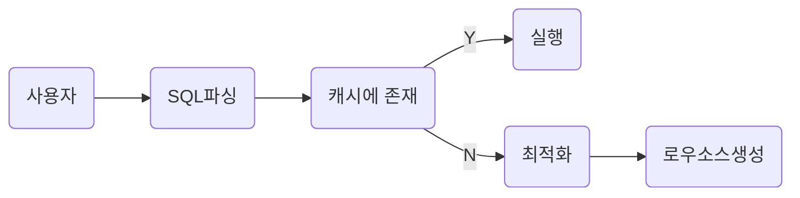
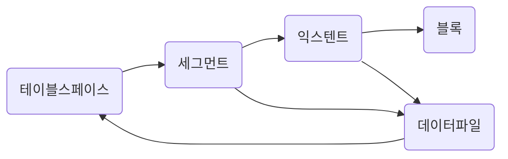
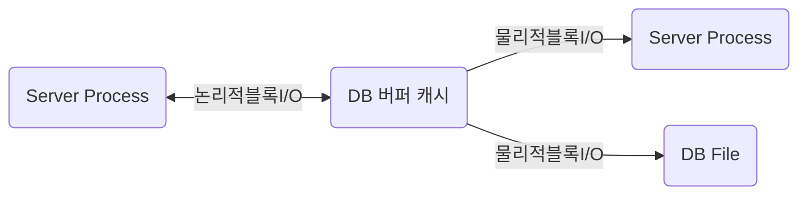

# SQLP

SQLP 준비

### SQL

→ Structured Query Language

→ 구조적 질의 언어

사용자 → (sql) → 옵티마이저 → (실행계획) → 프로시저

SQL 실행

1) SQL 파싱

- 파싱트리 생성
- SYNTAX 체크 : 문법적 오류 확인
- SEMANNTIC 체크 : 의미 상 오류 확인(존재하지 않는 테이블 OR 컬럼, 권한 존재 확인)

2) SQL 최적화

- SQL 옵티마이저는 미리 수집한 시스템 및 오브젝트 통계정보를 바탕으로 다향한 실행경로를 생성해서 비교한 후 가장 효울적인 하나를 선택한다.
- 성능을 결정하는 핵심적인 엔진

3) 로우 소스 생성 

- SQL 옵티마이저가 선택한 실행결로를 실제 실행 가능한 코드 또는 프로시저 형태로 포맷팅
- 로우 소스 생성기 가 그 역할을 맡음

※ SQL 옵티마이저

→ 사용자가 원하는 작업을 가장 효율적으로 수행할 수 있는 최적의 데이터 엑세스 경로를 선택해주는 DBMS의 핵심엔진이다.

1) 사용자로부터 전달 받은 쿼리를 수행하는 데 후보군이 될 만한 실행 계획을 찾아냄

2) 데이터 딕션너리에 미리 수집해 놓은 정보로  각 실행 계획의 예상 비용을 산정한다.

3) 최저 비용을 나타내는 실행 계획을 선택한다.

### 오라클 힌트 목록

**1. 최적화 목표**

- /*+ALL_LOWS */: 전체 처리속도 최적화
- /*+FIRST_ROWS(N) */ : 최초 N건 응답속도 최적화

**2.액세스 방식**

- /*+FULL */ :인덱스 타지말고 바로 테이블 풀스캔으로 접근해라
- /*+INDEX */: 인덱스를 타라
- /*+INDEX_DESC */: 인덱스를 ORDER BY DESC 역순으로 타라 (시간, 결과값등 최근인것 혹은 MAX값 구할때 좋음)
- /*+INDEX_FFS */: INDEX FAST FULL SCAN으로 타라
- /*+INDEX_SS */: INDEX SKIP SCAN

**3. 조인순서**

- /*+ORDERED */: FROM절에 나열된 테이블 순서대로 조인해라
- /*+LEADING */: 내가 힌트절에 열거한 테이블 순서대로 조인해라 EX: /*+ LEADING (A B C)*/

-- A,B,C 순서대로 조인하세요

- /*+SWAP_JOIN_INPUTS */: 해시조인의 경우, BUILD INPUT를 명시적으로 선택

EX: /*+ SWAP_JOIN_INPUTS(A)*/

--해시조인의경우 BUILD INPUT과 PROBE에 대한 순서를 정할 수 있다.

**4. 조인방식**

- /*+USE_NL */ :NL(NESTED LOOP - 중첩루프)방식 조인 유도
- /*+USE_MERGE */: 소트머지 조인으로 유도
- /*+USE_HASH */: 해시조인으로 유도
- /*+NL_SJ */: NL SEMI조인으로 유도
- /*+MERGE_SJ */: 소트머지 세미조인으로 유도
- /*+HASH_SJ */: 해시 세미조인으로 유도

**5. 서브쿼리팩토링**

- /*+MATERIALIZE */: WITH문으로 정의한 집합을 물리적으로 생성하도록 유도

EX) WITH /*+ MATERIALIZE*/ T AS (SELECT ...)

- /*+INLINE */: WITH문으로 정의한 집합을 물리적으로 생성하지않고 INLINE 처리하도록 유도

EX)WITH /*+ INLINE*/ T AS (SELECT ...)

**6.쿼리변환**

- /*+ MEERGE */: 뷰 머징 유도
- /*+NO_MERGE */: 뷰 머징 방지
- /*+UNNEST */: 서브쿼리 UNNESTING 유도
- /*+NO_UNNEST */: 서브쿼리 UNNESTING 방지
- /*+PUSH_PRED */: 조인조건 PUSHDOWN 유도
- /*+NO_PUSH_PRED */: 조인조건 PUSHDOWN 방지
- /*+USE_CONCAT */: OR 또는 IN-LIST조건을 OR-EXPANSION으로 유도
- /*+NO_EXPAND */: OR 또는 IN-LIST 조건에 대한 OR-EXPANSION방지

**7.병렬처리**

- /*+PARALLEL */: 테이블 스캔, DML 병렬방식으로 처리하도록 할때 사용.. 단일 대형 테이블의 접근시 정말 많이 쓴다.

EX) /*+ PARALLEL(T1 4)*/

- /*+PARALLEL_INDEX */: 인덱스 스캔을 병렬방식으로 처리하도록 유도
- /*+PQ_DISTRIBUTE */: 병렬수행시 데이터 분배방식 결정

EX) PQ_DISTRIBUTE(T1 HASH(--BUILD INPUT) HASH(--PROBE TABLE))

**8. 그외 기타**

- /*+APPEND*/: DIRECT PATH INSERT유도로 INSERT 문에 주로 많이 쓴다
- /*+DRIVING_SITE */: DB LINK REMOTE쿼리에 대한 최적화 및 실행 주체 지정 (LOCAL 또는 REMOTE)
- /*+PUSH_SUBQ */: 서브쿼리를 가급적 빨리 필터링하도록 유도
- /*+NO_PUSH_SUBQ */: 서브쿼리를 가급적 늦게 필터링 하도록 유도

### 소프트 파싱 VS 하드파싱

소프트 파싱 : 캐시에서 찾아서 곧바로 실행

하드 파싱 : 캐시에서 찾는 데 실패, 최적화 & 로우 소스 생성



※ 옵티마이저가 사용하는 정보

1) 테이블, 컬럼, 인덱스 구조에 관한 기본정보

2) 오브젝트 통계 : 테이블 통계, 인덱스 통계

3) 시스템 통계 : cpu속도, I/O 속도 등

→ 어렵게 생성한 프로시저를 한번만 사용하고 버린다면 비효율**(라이브러리 캐시가 필요한 이유)**

```sql
SELECT * FROM CUSTOMER WHERE LOGIN_ID ='oraking';
SELECT * FROM CUSTOMER WHERE LOGIN_ID ='oraking1';
SELECT * FROM CUSTOMER WHERE LOGIN_ID ='oraking2';
SELECT * FROM CUSTOMER WHERE LOGIN_ID ='oraking3';
-> 하드파싱

SELECT * FROM CUSTOMER WHERE LOGIN_ID = :?
-> 한번만 하드 파싱하고 소프트 파싱으로 처리 됨
```

### 데이터 저장 구조 및 I/O 매커니즘




- 블록 : 데이터를 읽고 쓰는 단위
- 엑스턴트 : 공간을 확장하는 단위, 연속된 블록 집합
- 세그먼트 : 데이터 자장공간이 필요한 오브젝트
- 테이블스페이스 : 세그먼트를 담는 콘테이너
- 데이터 파일 : 디스크 상의 물리적인 os 파일

※블록: DBMS가 데이터를 읽고 쓰는 단위(한 블록에 10ROW 가 있다면 1 ROW를 읽어도 한블록을 읽음)

### 시퀀셜 엑세스 VS 랜덤 엑세스

시퀀셜엑세스 : 논리적 또는 물리적으로 연결된 순서에 따라 차례대로 블록을 읽는 방식

랜덤엑세스 : 논리적 물리적 순서를 따르지 않고 한블로씩 접근

### 논리적 I/O VS 물리적 I

논리적 블록 I/O : SQL을 처리하는 과정에서 발생한 총 블럭 I/O

물리적 블록 I/O : 디스크에서 발생한 총 블록 I/O



버퍼캐시 히트율(BCHR)

: (캣기에서 찾은 블록 수 / 총 읽은 블록 수) * 100

: (논리적 I/O - 물리적 I/O ) / 논리적I/O * 100

: (1 - (물리적 I/O) / (논리적 I/O) * 100

히트율이 높아야함 !

**SQL 튜닝을 통해서 논리적 I/O 블록의 갯수를 줄이는 것이 튜닝**

| TABLE FULL SCAN | INDEX RANGE SCAN |
| --- | --- |
| MULTI BLOCKED I/O 방식 | SINGLE BLOCKED I/O 방식 |
| 수레에 데이터가 많다 | 수레에 데이터가 적다. |
|  | 반복적인 I/O |
