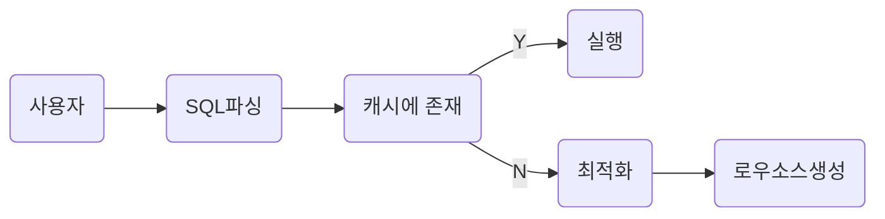
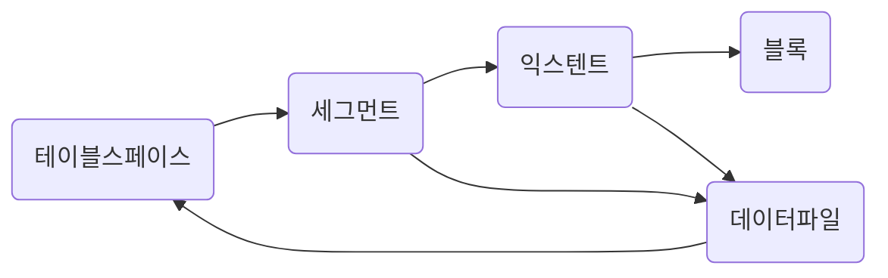
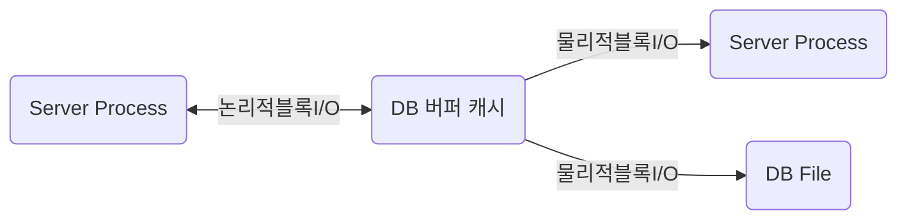

# SQLP

SQLP 준비

### SQL

→ Structured Query Language

→ 구조적 질의 언어

사용자 → (sql) → 옵티마이저 → (실행계획) → 프로시저

SQL 실행

1) SQL 파싱

- 파싱트리 생성
- SYNTAX 체크 : 문법적 오류 확인
- SEMANNTIC 체크 : 의미 상 오류 확인(존재하지 않는 테이블 OR 컬럼, 권한 존재 확인)

2) SQL 최적화

- SQL 옵티마이저는 미리 수집한 시스템 및 오브젝트 통계정보를 바탕으로 다향한 실행경로를 생성해서 비교한 후 가장 효울적인 하나를 선택한다.
- 성능을 결정하는 핵심적인 엔진

3) 로우 소스 생성 

- SQL 옵티마이저가 선택한 실행결로를 실제 실행 가능한 코드 또는 프로시저 형태로 포맷팅
- 로우 소스 생성기 가 그 역할을 맡음

※ SQL 옵티마이저

→ 사용자가 원하는 작업을 가장 효율적으로 수행할 수 있는 최적의 데이터 엑세스 경로를 선택해주는 DBMS의 핵심엔진이다.

1) 사용자로부터 전달 받은 쿼리를 수행하는 데 후보군이 될 만한 실행 계획을 찾아냄

2) 데이터 딕션너리에 미리 수집해 놓은 정보로  각 실행 계획의 예상 비용을 산정한다.

3) 최저 비용을 나타내는 실행 계획을 선택한다.

### 오라클 힌트 목록

**1. 최적화 목표**

- /*+ALL_LOWS */: 전체 처리속도 최적화
- /*+FIRST_ROWS(N) */ : 최초 N건 응답속도 최적화

**2.액세스 방식**

- /*+FULL */ :인덱스 타지말고 바로 테이블 풀스캔으로 접근해라
- /*+INDEX */: 인덱스를 타라
- /*+INDEX_DESC */: 인덱스를 ORDER BY DESC 역순으로 타라 (시간, 결과값등 최근인것 혹은 MAX값 구할때 좋음)
- /*+INDEX_FFS */: INDEX FAST FULL SCAN으로 타라
- /*+INDEX_SS */: INDEX SKIP SCAN

**3. 조인순서**

- /*+ORDERED */: FROM절에 나열된 테이블 순서대로 조인해라
- /*+LEADING */: 내가 힌트절에 열거한 테이블 순서대로 조인해라 EX: /*+ LEADING (A B C)*/

-- A,B,C 순서대로 조인하세요

- /*+SWAP_JOIN_INPUTS */: 해시조인의 경우, BUILD INPUT를 명시적으로 선택

EX: /*+ SWAP_JOIN_INPUTS(A)*/

--해시조인의경우 BUILD INPUT과 PROBE에 대한 순서를 정할 수 있다.

**4. 조인방식**

- /*+USE_NL */ :NL(NESTED LOOP - 중첩루프)방식 조인 유도
- /*+USE_MERGE */: 소트머지 조인으로 유도
- /*+USE_HASH */: 해시조인으로 유도
- /*+NL_SJ */: NL SEMI조인으로 유도
- /*+MERGE_SJ */: 소트머지 세미조인으로 유도
- /*+HASH_SJ */: 해시 세미조인으로 유도

**5. 서브쿼리팩토링**

- /*+MATERIALIZE */: WITH문으로 정의한 집합을 물리적으로 생성하도록 유도

EX) WITH /*+ MATERIALIZE*/ T AS (SELECT ...)

- /*+INLINE */: WITH문으로 정의한 집합을 물리적으로 생성하지않고 INLINE 처리하도록 유도

EX)WITH /*+ INLINE*/ T AS (SELECT ...)

**6.쿼리변환**

- /*+ MEERGE */: 뷰 머징 유도
- /*+NO_MERGE */: 뷰 머징 방지
- /*+UNNEST */: 서브쿼리 UNNESTING 유도
- /*+NO_UNNEST */: 서브쿼리 UNNESTING 방지
- /*+PUSH_PRED */: 조인조건 PUSHDOWN 유도
- /*+NO_PUSH_PRED */: 조인조건 PUSHDOWN 방지
- /*+USE_CONCAT */: OR 또는 IN-LIST조건을 OR-EXPANSION으로 유도
- /*+NO_EXPAND */: OR 또는 IN-LIST 조건에 대한 OR-EXPANSION방지

**7.병렬처리**

- /*+PARALLEL */: 테이블 스캔, DML 병렬방식으로 처리하도록 할때 사용.. 단일 대형 테이블의 접근시 정말 많이 쓴다.

EX) /*+ PARALLEL(T1 4)*/

- /*+PARALLEL_INDEX */: 인덱스 스캔을 병렬방식으로 처리하도록 유도
- /*+PQ_DISTRIBUTE */: 병렬수행시 데이터 분배방식 결정

EX) PQ_DISTRIBUTE(T1 HASH(--BUILD INPUT) HASH(--PROBE TABLE))

**8. 그외 기타**

- /*+APPEND*/: DIRECT PATH INSERT유도로 INSERT 문에 주로 많이 쓴다
- /*+DRIVING_SITE */: DB LINK REMOTE쿼리에 대한 최적화 및 실행 주체 지정 (LOCAL 또는 REMOTE)
- /*+PUSH_SUBQ */: 서브쿼리를 가급적 빨리 필터링하도록 유도
- /*+NO_PUSH_SUBQ */: 서브쿼리를 가급적 늦게 필터링 하도록 유도

### 소프트 파싱 VS 하드파싱

소프트 파싱 : 캐시에서 찾아서 곧바로 실행

하드 파싱 : 캐시에서 찾는 데 실패, 최적화 & 로우 소스 생성



※ 옵티마이저가 사용하는 정보

1) 테이블, 컬럼, 인덱스 구조에 관한 기본정보

2) 오브젝트 통계 : 테이블 통계, 인덱스 통계

3) 시스템 통계 : cpu속도, I/O 속도 등

→ 어렵게 생성한 프로시저를 한번만 사용하고 버린다면 비효율**(라이브러리 캐시가 필요한 이유)**

```sql
SELECT * FROM CUSTOMER WHERE LOGIN_ID ='oraking';
SELECT * FROM CUSTOMER WHERE LOGIN_ID ='oraking1';
SELECT * FROM CUSTOMER WHERE LOGIN_ID ='oraking2';
SELECT * FROM CUSTOMER WHERE LOGIN_ID ='oraking3';
-> 하드파싱

SELECT * FROM CUSTOMER WHERE LOGIN_ID = :?
-> 한번만 하드 파싱하고 소프트 파싱으로 처리 됨
```

### 데이터 저장 구조 및 I/O 매커니즘




- 블록 : 데이터를 읽고 쓰는 단위
- 엑스턴트 : 공간을 확장하는 단위, 연속된 블록 집합
- 세그먼트 : 데이터 자장공간이 필요한 오브젝트
- 테이블스페이스 : 세그먼트를 담는 콘테이너
- 데이터 파일 : 디스크 상의 물리적인 os 파일

※블록: DBMS가 데이터를 읽고 쓰는 단위(한 블록에 10ROW 가 있다면 1 ROW를 읽어도 한블록을 읽음)

### 시퀀셜 엑세스 VS 랜덤 엑세스

시퀀셜엑세스 : 논리적 또는 물리적으로 연결된 순서에 따라 차례대로 블록을 읽는 방식

랜덤엑세스 : 논리적 물리적 순서를 따르지 않고 한블로씩 접근

### 논리적 I/O VS 물리적 I

논리적 블록 I/O : SQL을 처리하는 과정에서 발생한 총 블럭 I/O

물리적 블록 I/O : 디스크에서 발생한 총 블록 I/O



버퍼캐시 히트율(BCHR)

: (캣기에서 찾은 블록 수 / 총 읽은 블록 수) * 100

: (논리적 I/O - 물리적 I/O ) / 논리적I/O * 100

: (1 - (물리적 I/O) / (논리적 I/O) * 100

히트율이 높아야함 !

**SQL 튜닝을 통해서 논리적 I/O 블록의 갯수를 줄이는 것이 튜닝**

| TABLE FULL SCAN | INDEX RANGE SCAN |
| --- | --- |
| MULTI BLOCKED I/O 방식 | SINGLE BLOCKED I/O 방식 |
| 수레에 데이터가 많다 | 수레에 데이터가 적다. |
|  | 반복적인 I/O |


# 인덱스 구조 및탐색

홍길동 학생을 찾는 방법

1) 모든 교실을 돌면서 찾기

2) 학생 명부를 조회해 홍길동 학생이 있는 교실만 찾아냄

### 인덱스를 통한 데이터 탐색 과정

1) 수직적 탐색 + 수평적 탐색을 통한 인덱스 탐색 진행

2) 인덱스 탐색에서 나온 rowId를 통해서 테이블 랜덤 엑세스 

### 인덱스 원리

(SELECT * FROM 고객 WHERE 고객명 = ‘이재희’)

1) 수직적 탐색 + 수평적 탐색을 통한 인덱스 탐색 진행


1) ROOT 에서 “서” 로 확인을 해봤을 때 이재희는 서 보다 뒤에 있다. 

→ 따라서 서 뒤에 있는 BRANCH 로 이동

2) BRANCH 에서 계속 스캔을 하다가 이재희보다 뒤에 있는 이재홍을 확인

→ 해당 LEAF로 내려간다.

**—> 여기까지가 수직적 탐색**

3) 이재희가 있는 곳에서 계속 조건에 만족하는 이재희를 찾는다.

**—> 여기가 수평적 탐색**

4) 인덱스 탐색을 통해서 가져온 ROW ID를 통해서 테이블에서 데이터를 가져온다.

**—> 랜덤 액세스**  

### **Index Range Scan**

- 스캔 지점에 시작점과 종료점이 있어야함
- 인덱스 컬럼이 가공되면 사용 못함(EX) 5월생의 데이터를 가져온다고 했을 때 인덱스의 시작점과 종료점을 알수 없기 때문(날짜 순으로 정렬)
- IN 조건절에 대해서는 IN-LIST Iterator 방식을 사용(IN-LIST 갯수만큰 INDEX RANGE SCAN 반복, UNION ALL 처럼)
- 인덱스의 선두컬럼이 가공되지 않으면 무조건 RANGE SCAN 이 가능한다.
- 선두 컬럼만 가공되지 않는다고 하더라도 문제가 없는 건 아님(범위가 그만큼 안 줄어들기 때문)
- 인덱스는 정렬이 되어있다. (인덱스 스캔을 할 수 있는 이유)
→ 따라서 인덱스를 사용하면 ORDER BY 를 하더라도 SORT 연산을 하지 않는다.


### **Index Full scan**

- 수직점 탐색을 하지 않고 수평적 탐색만 진행
- ename, sal 순으로 인덱스가 생성이 되었을 때 조회 조건이 sal 만 있다면 range 시작 지점과 종료지점을 정의하기가 어려워서 전체를 스캔한다.
- 즉 선두컬럼이 조회 조건에 없는 경우이다.
- 인덱스 전체 스캔
- 데이터가 적을 경우 효율적이지만 데이터가 많은 경우 그냥 테이블 full scan 이 좋다.(row id 로 테이블에 접근하는 건이 엄청 많을 거기 때문에,,)


### **Index Unique scan**

- 수직점 탐색으로만 데이터를 찾는 스캔 방식(= 조건으로 unique 인덱스)


### **Index Skip scan**

- 인덱스의 선두 컬럼이 조회 조건에 없구 데이터가 별로 없을 때는 index full scan
- 인덱스의 선두 컬럼이 조회 조건에 없구 데이터가 많은 경우 table full scan
- **인덱스의 선두 컬럼이 조건절에 없어도 인덱스를 활용하는 새로운 스캔 방식
(선두 컬럼의 Distinct Value 개수가 적고 후행 컬럼의 Distinct Value 개수가 많을 때 유용)**


```sql
select * from 사원 where 성별 = '남' and 연봉 between 2000 and 4000
```

1) 해당 쿼리를 한다면 3번 블럭을 수직적 탐색을 통해서 가져와서 rowid로 테이블을 접근한다.

```sql
select * from 사원 where 연봉 between 2000 and 4000
```

1) 해당 쿼리를 한다면 1번 블록(처음), 3번 블록 6번 블록, 7번 블록, 10번 블록(마지막)을 가져와서 rowId로 테이블에 접근한다.
**→ 특정 블록만 가져온다**

### **Index Fast Full scan**

- Multiblock I/O 방식으로 스캔해서 INDEX FULL SCAN 보다 빠름
(동시에 여러개의 브랜치에서 리프에 접근한다.)

| Index Full Scan | Index Fast Full Scan |
| --- | --- |
| 인덱스 구조를 따라 스캔 | 세그먼트 전체를 스캔 |
| 결과 집합 순서를 보장 | 결과집합 순서 보장 안됨 |
| Single Block I/O | MultiBlock I/O |
| 병렬 스캔 불가 | 병렬 스캔 가능 |
| 인덱스가 포함되지 않은 컬럼 조회 시에도 사용 가능 | 인덱스에 포함된 컬럼으로만 조회할 때 사용 가능 |

### **Index Range Scan Descending**

- 뒤에서 앞으로 스캔하는 것만 다름(내림차순)


# 인덱스 튜닝

1) 아무리 데이터가 많아도 인덱스를 사용하니까 데이터가 금방 조회된다.

2) 대량 데이터를 조회할 때 인덱스를 사용하니까 테이블 전체를 스캔할 때보다 훨씬 느리다.

**TABLE ACCESS BY INDEX ROWID**


- 인덱스를 스캔하는 이유는, 검색 조건을 만족하는 소량의 데이터를 인덱스에서 빨리 찾고 거기서 테이블 레코드를 찾아가기 위한 주소값, 즉 ROWID를 얻으려는 데 있다.

- ROWID → 물리적 주소보다 논리적 주소에 가깝다.
(물리적으로 직접 연결되지 않고 테이블 레코드를 찾아가기 위한 논리적 주소 정보를 담고 있기 때문이다.),
**→ 즉 ROWID를 통해서 테이블에 접근하는 것은 생각보다 빠르지 않다.(BCHR 이 높아서 캐시에 있더라도, 데이터 블록이 수시로 버퍼캐시에서 밀려났다가 다시 캐싱되기 때문에)**
- **인덱스 ROWID 는 우편번호(메모리 DB가 전화), 우편번호가 있더라도 시간이 꽤 걸림..**


### 인덱스 클러스터링 팩터

→ 특정 컬럼을 기준으로 같은 값을 갖는 데이터가 서로 모여있는 정도


- 굵은 선이 실제 블록 I/O가 발생하는 경우
- 클러스터링 팩터가 좋은 컬럼으로 인덱스를 작성하는 것이 블록 I/O를 감소시킬수 있다.

### 인덱스 손익분기점

- 인덱스 ROWID를 이용한 테이블 액세스는 생각보다 고비용 구조다
- **따라서 읽어야 할 데이터가 일정량을 넘는 순간, 테이블 전체를 스캔하는 것보다 오히려 느려진다.**
- TABLE FULL SCAN 은 몇건을 조회하던지 전부 동일!

**※ 인덱스를 이용한 테이블 액세스가 Table Full Scan 보다 더 느려지게 만드는 가장 핵심적인 두가지 요인**

1) Table Full Scan 은 시퀀셜 액세스인 반면, 인덱스 ROWID를 이용한 테이블 엑세스는 랜덤 액세스 방식이다.

2) Table Full Scan 은 Multiblock I/O인 반면, 인덱스 ROWID를 이용한 테이블 액세스는 Single Block I/O 방식이다.


→ 인덱스 클러스터링 팩터가 높을 수도 손익분기점이 높아진다.(데이터가 모여있어서 ROWID를 통해서 테이블에 접근하기가 쉽기 때문에)

### 인덱스 컬럼 추가

```sql
EMP_X01 인덱스[DEPTNO, JOB]

SELECT /*+INDEX(emp emp_x01) */ /*
from emp
where deptno = 30
and sal >= 2000
```

1) 인덱스 스캔을 통해서 인덱스에서 deptno = 30 인 데이터를 전부 가져오고(ex) 6개) 
2) 인덱스를 통해서 테이블 엑세스를 한다.(6개)

```sql
EMP_X01 인덱스[DEPTNO, JOB, SAL]

SELECT /*+INDEX(emp emp_x01) */ /*
from emp
where deptno = 30
and sal >= 2000
```

1) 인덱스 스캔을 통해서 인덱스에서 deptno = 30 인 데이터를 전부 가져오고(ex) 1개) 

2) 인덱스를 통해서 테이블 엑세스를 한다.(1개)

**※ 인덱스 스캔량은 줄지 않지만, 테이블 랜덤 액세스 횟수를 줄여준다.**

※ 추가적으로 조회하는 모든 컬럼이 인덱스에 존재하면 테이블 액세스를 하지 않기 떄문에 성능이 좋다.

**include 인덱스**

```sql
create index emp_x01 on emp(deptno) include(sal)

create index emp_x02 on emp(deptno, sal)
```

→ EMP_X02 인덱스는 DEPTNO, SAL 컬럼 모두 루트와 브랜치 블록에 저장(수직전 탐색 가능)

→ EMP_X01 인덱스는 SAL 컬럼을 리프 블록에만 저장해서 수평적 탐색에만 사용 가능함
    (랜덤 액세스 횟수를 줄이는 용도로 사용한다. **따라서 소트 연상을 생략할 수 없다**.)

### 인덱스 구조 테이블

- 인덱스의 ROWID를 이용한 테이블 액세스가 고비용 구조이니, 랜덤 액세스가 발생하지 않도록 테이블을 인덱스 구조로 생성하는 것


### 인덱스 클러스터 테이블

- 클러스터 키값이 같은 레코드를 한 블록에 모아서 저장하는 구조
- 랜덤엑세스를 할때 블록 단위로 진행하는데 모아 놨기 때문에 랜덤엑세스를 줄일 수 있다.


※ 해시 클러스트 테이블

→ 인덱스를 사용하지 않고 해시 알고리즘을 사용


### 부분범위 처리 활용

- fetch call 갯수 → 1억건을 조회하더라도 fetch size 100이면 느리지 않다.
- 정렬이 있다면? → 느리지만 정렬조건이 인덱스에 있다면 엄청 느리지 않다.

```sql
SELECT 게시글ID, 제목, 작성자, 등록일시
FROM 게시판
WHERE 게시판구분코드 = 'A'
ORDER BY 등록일시 DESC
```

1) 부분처리를 하려고 해도 소트연산을 생략할 수 없다.

2) 인덱스가 [게시판 구분코드 + 등록일수] → 소트연산 생략 가능하다.(인덱스가 정렬되어있기 때문에)

### 배치 I/O란?

- 인덱스 RowId를 이용한 테이블 랜덤엑세스는 고비용
- 바로 테이블에 접근하는 게 아니라 블록이 일정량 쌓이면 접근을 한다.
- 대시 sort 연산이 해결되지 않음(바로바로 접근하는게 아니여서)
- 인덱스를 믿고 정렬 생략하는 거를 지양해라(배치 i/o)

### 인덱스 스캔 효율화


```sql
WHERE C1 = 'B'
```


```sql
WHERE C1 ='B'
AND C2 = 3
```


```sql
WHERE C1 = 'B'
AND C2 >=3
```


```sql
WHERE C1 = 'B'
AND C2 <=3
```


```sql
WHERE C1 = 'B'
AND C2 BETWEEN 2 AND 3
```


```sql
WHERE C1 BETWEEN 'A' AND 'C'
AND C2 BETWEEN 2 AND 3
```


- C1 조건절은 스캔 시작과 끝 지점을 결정하는 중요한 역할을 함
- C2는 그렇지 못함, C1 =A,  C 구간에서는 어느정도 역할을 했지만 중간 C1 = ‘B’ 구간에서는 전혀 역할을 못 했다.


### 인덱스 스캔 효율성


질문1) 성능검 으로 시작하는 용어를 검색하고자 할 때 어디서 스캔을 시작하고 멈출까?

질문2) 성능으로 시작하고 네 번째 문자가 선인 용어를 검색하고자 할 때 어디서 스캔을 시작하고 멈출까?


**인덱스 선행컬림이 조건절이 없거나 = 조건이 아니면 인덱스 스캔 과정에서 비효율 발생**

### 액세스 조건과 필터 조건


 c1=성, c2=능, c4=선 
c5 =’강’(인덱스 아님) 으로 조회한다고 했을 때 

1) 인덱스 엑세스 조건

c1, c2

2) 인덱스 필터 조건

c4

3) 테이블 필터 조건

c5

### 비교 연산자 종류와 컬럼 순서에 따른 군집성


```sql
<조건절 1>
WHERE C1 = 1
AND C2 ='A'
AND C3 ='나'
AND C4 = 'a'
```

모든 레코드들이 모두 연속해서 모여 있다.(5 ~ 7번)

```sql
<조건절 2>
WHERE C1 = 1
AND C2 ='A'
AND C3 ='나'
AND C4 >= 'a'
```

모든 레코드들이 모두 연속해서 모여 있다.(5 ~ 10번)

```sql
<조건절 3>
WHERE C1 = 1
AND C2 ='A'
AND C3 between '가' and '다'
AND C4 = 'a'
```

C1, C2, C3 레코드는 모여있으나, C4 조건까지 적용하면 흩어짐(2,3,5,6,7,11번)

```sql
<조건절 4>
WHERE C1 = 1
AND C2 <='B'
AND C3 = '나'
AND C4 BETWEEN 'a' and 'b'
```

C1, C2 레코드는 모여있으나, C3, C4 조건까지 적용하면 흩어짐(5,6,7,8,9,14,15번)

**※선행컬림이 모두  = 조건인 상태에서는 첫번째 나타나는 범위검색 조건까지만 만족하는 인덱스 레코드는 모두 연속해서 모여 있지만, 그 이하 조건까지 만족하는 레코드는 비교 연산자 종류에 상관없이 흩어진다.**

```sql
<조건절 5>
WHERE C1 BETWEEN A AND 3
AND C2 <='A'
AND C3 = '나'
AND C4 ='a'
```

C1  레코드는 모여있으나 C2, C3, C4 조건까지 적용하면 흩어짐(5,6,7,18번)


### 인덱스 선행 컬럼이 등치(=) 조건이 아닐 때 생기는 비효율

```sql
SELECT *
FROM 매물아파트매매
WHERE 아파트시세코드 ='A01011350900056'
AND 평형 = '59'
AND 평형타입 = 'A'
AND 인터넷매물 BETWEEN '1' AND '3'
ORDER BY 입력일 DESC
```

1) 인덱스가 [아파트시세코드, 평형, 평형타입, 인터넷매물] 

→ 선행컬럼이 모두 = 조건이기 때문에 전혀 비효율 없이 조건을 만족하는 세 건을 빠르게 찾음


2) 인덱스가 [인터넷매물, 아파트시세코드, 평형, 평협타입]

→ 선행컬림이 = 조건이 아니기 때문에 비효율적으로 처리됨


### BETWEEN을 IN-List 로 전환

```sql
SELECT *
FROM 매물아파트매매
WHERE 아파트시세코드 ='A01011350900056'
AND 평형 = '59'
AND 평형타입 = 'A'
AND 인터넷매물 in ('1','2','3')
ORDER BY 입력일 DESC
```


⇒ 수직적 탐색을 세번 진행한거(INLIST ITERATOR 오퍼레이션)


해당 쿼리와 동일하다고 보면 된다.

```sql
SELECT *
FROM 매물아파트매매
WHERE 아파트시세코드 ='A01011350900056'
AND 평형 = '59'
AND 평형타입 = 'A'
AND 인터넷매물 = '1'
UNION ALL
SELECT *
FROM 매물아파트매매
WHERE 아파트시세코드 ='A01011350900056'
AND 평형 = '59'
AND 평형타입 = 'A'
AND 인터넷매물 = '2'
UNION ALL
SELECT *
FROM 매물아파트매매
WHERE 아파트시세코드 ='A01011350900056'
AND 평형 = '59'
AND 평형타입 = 'A'
AND 인터넷매물 = '3'
ORDER BY 입력일 DESC
```

### BETWEEN조건은 IN-List로 전환할 때 주의 사항


- IN-List 갯수가 많으면 우측처럼 수직적 탐색이 많이 발생한다.(비효율적)

### Index Skip Scan 활용

- Between 조건은 IN-List 조건으로 변환하지 않고도 같은 효과를 내는 방법

```sql
select count(*)
from 월별고객별판매집계 t
where 판매구분 = 'A'
and 판매월 between '201801' and '201812'
```

```sql
create index 월별고객별판매집계_IDX1 on 원별고객별판매집계(판매구분, 판매월);
```

→ 선행컬럼이 = 조건이여서 최적의 처리 

```sql
create index 월별고객별판매집계_IDX2 ON 월별고객별판매집계(판매월, 판매구분
```


- 인덱스 스캔 범위가 넓어져서 효율적이지 않다.

**→ 이런 경우 in으로 바꾸는 방법도 있지만 index skip scan을 활용할 수도 있다.**

```sql
select /*+ INDEX_SS(t 월별고객별판매집계_IDX2) */ COUNT(*)
from 원별고객별판매집계 t
where 판매구분 ='A'
and 판매월 between '201801' and '201812'
```

### IN 조건은 ‘=’ 인가?

```sql
SELECT *
FROM 고객별가입상품
WHERE 고객번호 = :cust_no
AND 상품ID IN('NH0037','NH0041','NH0050')

```

```sql
SELECT *
FROM 고객별가입상품
WHERE 고객번호 = :cust_no
AND 상품ID ='NH0037'
UNION ALL
SELECT *
FROM 고객별가입상품
WHERE 고객번호 = :cust_no
AND 상품ID ='NH0041'
UNION ALL
SELECT *
FROM 고객별가입상품
WHERE 고객번호 = :cust_no
AND 상품ID ='NH0050'

```

→ 첫번째 쿼리가 아래처럼 풀리면 IN 조건이 =을 여러번 사용하는 것

- IN 조건은 ‘=’이 아니다. IN 조건이 ‘=’이 되려면 IN=List Iterator 방식으로 풀려야 한다.
- 그렇지 않으면 IN 조건은 필터 조건이다.
- 무조건 IN 조건을 ‘=’ 조건으로 만들기 위해, IN-List Iterator 방식으로 푸는 것이 항상 효과적인가?
→ 범위에 따라 다르다고 보면 된다.
